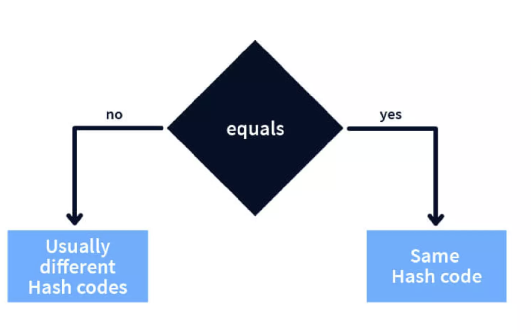

## Tìm hiểu tổng quan về Collection

- Collection là 1 đối tượng chứa một nhóm đối tượng

- Collection có 1 số interface sau:
  | Interface | Implementation Classes |
  |-----------|------------------------------------------------------------------|
  | Set | HashSet, LinkedHashSet, EnumSet, CopyOnWriteArraySet |
  | List | ArrayList, LinkedList, CopyOnWriteArrayList |
  | Map | HashMap, LinkedHashMap, EnumMap, IdentityHashMap, WeakHashMap |

## So sánh

| Main Collection Classes | D   | O   | E   | TS  |
| ----------------------- | --- | --- | --- | --- |
| HashSet                 | No  | No  | No  | No  |
| ArrayList               | Yes | Yes | No  | No  |
| HashMap                 | No  | No  | No  | No  |

- Trong bảng này:

  - D đại diện cho "Duplicates" (trùng lặp).
  - O đại diện cho "Ordering" (thứ tự).
  - E đại diện cho "Efficient Index-Based Access" (truy cập dựa trên chỉ mục hiệu quả).
  - TS đại diện cho "Thread Safe" (an toàn luồng).

- HashMap:

  - Lưu trữ cặp khóa-giá trị.
  - Không cho phép các khóa trùng lặp.
  - Truy cập nhanh dựa trên khóa.

- HashSet:

  - Lưu trữ các phần tử không trùng lặp.
  - Thêm, xóa, kiểm tra phần tử nhanh.
  - Không duy trì thứ tự chèn.

- ArrayList:

  - Lưu trữ các phần tử theo thứ tự chèn vào.
  - Cho phép các phần tử trùng lặp.
  - Truy cập phần tử nhanh theo chỉ số.

## HashMap

- HashMap là một cấu trúc dữ liệu ánh xạ các khóa tới các giá trị. Nó lưu trữ dữ liệu theo cặp khóa-giá trị và không cho phép các khóa trùng lặp.

- Phương thức chính của HashMap:

- put(K key, V value): Thêm một cặp khóa-giá trị vào HashMap.
- get(Object key): Trả về giá trị liên kết với khóa được chỉ định.
- containsKey(Object key): Kiểm tra xem HashMap có chứa khóa được chỉ định không.
- remove(Object key): Xóa mục với khóa được chỉ định khỏi HashMap.

## HashSet

- HashSet là một tập hợp không chứa các phần tử trùng lặp. Nó sử dụng HashMap nội bộ để lưu trữ các phần tử.

- Phương thức chính của HashSet:

  - add(E e): Thêm một phần tử vào HashSet.
  - contains(Object o): Kiểm tra xem HashSet có chứa phần tử được chỉ định không.
  - remove(Object o): Xóa phần tử khỏi HashSet.

## ArrayList

- ArrayList là một mảng động, cho phép lưu trữ các phần tử theo thứ tự chèn vào và có thể thay đổi kích thước động.

- Phương thức chính của ArrayList:

  - add(E e): Thêm một phần tử vào cuối ArrayList.
  - get(int index): Trả về phần tử tại vị trí chỉ định.
  - remove(int index): Xóa phần tử tại vị trí chỉ định.
  - size(): Trả về số lượng phần tử trong ArrayList.

## Hashcode và equals

- hashCode: Là một mã băm (hash code) của đối tượng. Nó được sử dụng bởi các cấu trúc dữ liệu dựa trên bảng băm như HashMap và HashSet để nhanh chóng tìm kiếm, thêm hoặc xóa các phần tử.
  Phương thức này trả về 1 số nguyên.

- equals: Được sử dụng để kiểm tra xem hai đối tượng có bằng nhau hay không.
  Khi ghi đè equals, bạn nên ghi đè hashCode để đảm bảo rằng các đối tượng bằng nhau có cùng mã băm.

- Contract giữa hashCode và equals:
  Hai đối tượng bằng nhau theo phương thức equals() phải có cùng mã băm. Tuy nhiên, hai đối tượng có cùng mã băm không nhất thiết phải bằng nhau.
  

- Tính duy nhất: Mã băm không cần phải là duy nhất. Nếu hai đối tượng có mã băm giống nhau, chúng được gọi là có một "va chạm" (collision). Khi có va chạm, các cấu trúc dữ liệu như HashMap hoặc HashSet sẽ quản lý chúng bằng cách sử dụng danh sách liên kết hoặc các cơ chế khác để phân biệt các đối tượng.

- Hiệu suất: Một hàm băm tốt sẽ phân phối mã băm đều đặn để giảm thiểu va chạm, từ đó tăng hiệu suất cho các hoạt động như tìm kiếm và lưu trữ.

- hashCode và equals là hai phương thức cần thiết để xác định tính duy nhất của các đối tượng trong các cấu trúc dữ liệu băm.

- Cách hashCode hoạt động trong Set: https://www.youtube.com/watch?v=TcKtHzDe6Qo
  
- Thêm phần tử (add method):

  - Khi bạn thêm một phần tử vào HashSet, Java sẽ gọi phương thức hashCode() của đối tượng đó để tính toán mã băm.
  - Mã băm này sau đó sẽ được sử dụng để xác định chỉ mục trong một bảng băm (hash table) nội bộ (Mỗi giá trị hashCode tương ứng với một vị trí bucket trong HashMap. Nếu hai đối tượng có cùng giá trị hashCode, chúng có thể được lưu trữ trong cùng một bucket. Tuy nhiên, hai đối tượng có cùng hashCode không nhất thiết phải bằng nhau. Điều này giải thích tại sao phương thức equals không được gọi .).
  - Nếu không có đối tượng nào ở chỉ mục đó, phần tử mới sẽ được thêm vào.
  - Nếu đã có đối tượng ở chỉ mục đó, Java sẽ sử dụng phương thức equals() để kiểm tra xem phần tử mới có bằng với phần tử đã tồn tại không:
  - Nếu bằng nhau (tức là equals trả về true), phần tử sẽ không được thêm vào HashSet (do HashSet không cho phép các phần tử trùng lặp).
  - Nếu không bằng nhau, phần tử mới sẽ được lưu trữ trong một danh sách liên kết tại chỉ mục đó để quản lý va chạm.
    
