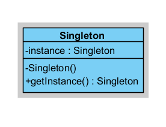
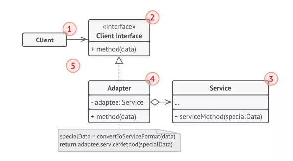
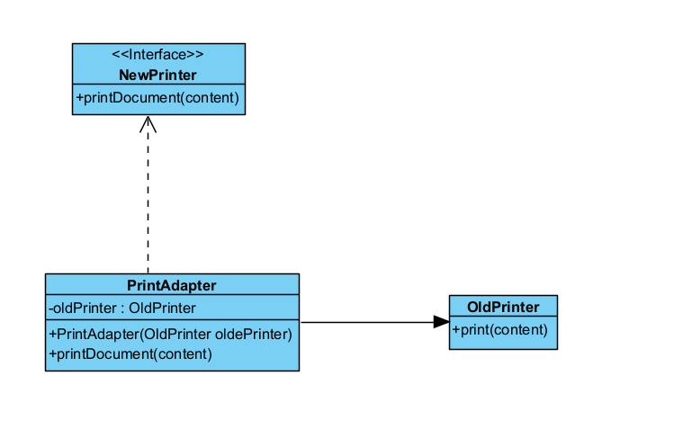
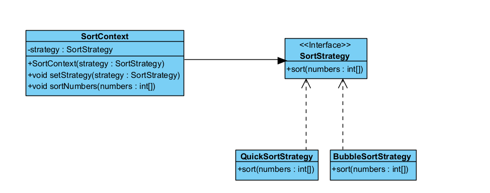

## Các design pattern cơ bản:

- Creational Patterns (Nhóm khởi tạo): Tạo các đối tượng một cách linh hoạt và hiệu quả.
  gồm có:
  - Factory Pattern
  - Abstract Factory Pattern
  - Singleton Pattern
  - Prototype Pattern
  - Builder Pattern
- Structural Patterns (Nhóm cấu trúc): Tổ chức các đối tượng và lớp để hình thành các cấu trúc lớn hơn.
  gồm có:
  - Adapter Pattern
  - Bridge Pattern
  - Composite Pattern
  - Decorator Pattern
  - Facade Pattern
  - Flyweight Pattern
  - Proxy Pattern
- Behavioral Patterns (Nhóm hành vi): Định nghĩa cách các đối tượng tương tác và phân chia trách nhiệm.
  gồm có:

  - Chain Of Responsibility Pattern
  - Command Pattern
  - Interpreter Pattern
  - Iterator Pattern
  - Mediator Pattern
  - Memento Pattern
  - Observer Pattern
  - State Pattern
  - Strategy Pattern
  - Template Pattern
  - Visitor Pattern

  ## Singletion Pattern

  - Sử dụng để đảm bảo rằng một lớp chỉ có duy nhất một đối tượng (instance) và cung cấp một cách để truy cập global đến thể hiện đó.

  - Thường được sử dụng khi bạn muốn có một thực thể duy nhất để quản lý tài nguyên chung hoặc cấu hình toàn cục trong ứng dụng của mình.

  - Đặc điểm của Singleton Pattern:

    - Constructor private: Để ngăn chặn việc khởi tạo đối tượng từ bên ngoài lớp.
    - Biến static private instance: Lưu trữ tham chiếu tới thực thể duy nhất của lớp.
    - Phương thức static public getInstance(): Cung cấp cách truy cập đến thực thể Singleton.

  - Lợi ích của Singleton Pattern:
    - Đảm bảo duy nhất: Một lớp chỉ có một thực thể duy nhất, giúp tiết kiệm tài nguyên và duy trì tính nhất quán.
    - Tiện dụng trong quản lý tài nguyên toàn cục: Ví dụ như đối tượng kết nối đến cơ sở dữ liệu, ghi log, cấu hình ứng dụng, ...
    - Thiết kế linh hoạt: Dễ dàng thay đổi từ việc sử dụng nhiều thực thể đến duy nhất.

```
public class Singleton {
    private static Singleton instance;

    // private constructor để ngăn chặn việc khởi tạo từ bên ngoài
    private Singleton() {
    }

    // phương thức static để lấy instance duy nhất của Singleton
    public static Singleton getInstance() {
        if (instance == null) {
            instance = new Singleton();
        }
        return instance;
    }

}
```



https://refactoring.guru/design-patterns/singleton

## Adapter Pattern

- Nó giúp ghép nối các lớp với các giao diện không tương thích bằng cách cung cấp một lớp trung gian (adapter) để chuyển đổi giao diện của một lớp thành giao diện khác mà người dùng mong đợi.
  => Điều này cho phép các lớp hoạt động cùng nhau mà không cần phải sửa đổi mã nguồn của chúng.

- Các thành phần trong mô hình:
  

  - Client là một class chứa business logic của chương trình
  - Client interface mô tả một giao thức mà các lớp khác phải tuân theo để có thể collab với client code
  - Service: là một class hữu ích (thường là bên thứ 3 hoặc kế thừa). Client không thể sử dụng trực tiếp lớp này vì nó có interface không tương thích.
  - Adapter: là một class có thể hoạt động với cả client và service: nó implements client interface, trong khi đóng gói service object. Adapter khi được gọi từ Client thông qua Adapter Interface sẽ chuyển chúng thành các cuộc gọi service object được bao bọc ở định dạng mà nó có thể hiểu được.

- Khi nào sử dụng Adapter Pattern?

  - Khi bạn muốn sử dụng một lớp hiện có nhưng giao diện của nó không khớp với giao diện mà bạn cần.
  - Khi bạn muốn tạo một lớp tái sử dụng mà không cần phải sửa đổi mã nguồn của lớp hiện có.


https://refactoring.guru/design-patterns/adapter
https://viblo.asia/p/adapter-design-pattern-tro-thu-dac-luc-cua-developers-Az45bqYQlxY

## Strategy Pattern

- Cho phép định nghĩa một họ các thuật toán, đóng gói từng thuật toán lại và làm cho chúng có thể thay thế cho nhau.
- Strategy Pattern cho phép thuật toán thay đổi một cách linh hoạt mà không ảnh hưởng đến các client sử dụng thuật toán đó.

- Các thành phần:
  

  - Context: Class sử dụng các strategy object và chỉ giao tiếp với các strategy object thông qua interface
  - Strategy: Cung cấp một interface chung cho context giao tiếp với các strategy object
  - Concrete Strategy: Implement các thuật toán khác nhau cho context sử dụng
  - Client: Có trách nhiệm tạo ra các strategy object và truyền vào cho context sử dụng

  
  https://refactoring.guru/design-patterns/strategy
  https://viblo.asia/p/strategy-design-pattern-tro-thu-dac-luc-cua-developers-bJzKmdwP59N
