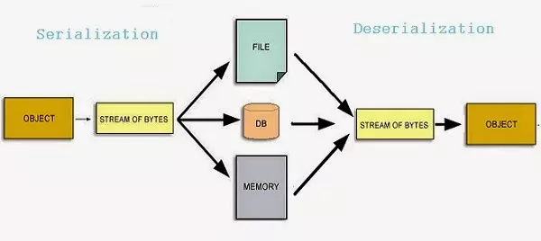

## Serialization là gì?

- Serialization trong Java là cơ chế chuyển đổi trạng thái của một đối tượng thành một luồng byte để có thể lưu trữ hoặc truyền tải đối tượng đó và sau đó có thể phục hồi lại đối tượng từ luồng byte đó (Deserialization ).

- Quá trình này rất quan trọng cho các thao tác như lưu đối tượng vào tệp, gửi đối tượng qua mạng, hoặc lưu trữ trong cơ sở dữ liệu.
  

## Các khái niệm khác

- Để mà serialize một object, bạn cần phải đảm bảo rằng class của object đó implements java.io.Serializable interface.

  - Serializable interface chỉ là một marker interface, tức là không có phương thức nào cần phải triển khai.
  - Nó chỉ có nhiệm vụ chỉ ra đây là object có thể serialized được.

- Hai lớp ObjectInputStream và ObjectOutputStream chứa các phương thức dùng để serializing và deserializing một object.

  - ObjectOutputStream : public final void writeObject(Object x) throws IOException => đây là phương thức để serializes một Object và gửi nó đến một output stream

  - ObjectInputStream : public final Object readObject() throws IOException, ClassNotFoundException => đây là phương thức để lấy ra object từ stream và deserializes nó. Giá trị trả về là một object, vì vậy bạn cần phải ép kiểu cho nó.

## Các đặc điểm quan trọng khác

- serialVersionUID:

  - serialVersionUID là một định danh duy nhất cho mỗi class được sử dụng trong quá trình deserialization để xác minh rằng người gửi và người nhận của một đối tượng đã tuần tự hóa (serialized) đã tải các class cho đối tượng đó tương thích với nhau.
  - Mục đích của biến này là để chắc chắn trước và sau khi chuyển đổi, class của chúng ta là một
  - Nên khai báo serialVersionUID rõ ràng để duy trì sự nhất quán.
    https://www.youtube.com/watch?v=VAZOhqFBqDE

- Từ khóa transient:

  - Nếu một trường được đánh dấu là transient, nó sẽ không được serialized.
  - Điều này hữu ích cho các trường chứa dữ liệu nhạy cảm hoặc dữ liệu có thể được tính toán lại.

- Tuần Tự Hóa Tùy Biến:

  - Bạn có thể tùy chỉnh quá trình tuần tự hóa bằng cách triển khai các phương thức writeObject và readObject trong lớp của bạn. Điều này hữu ích khi bạn cần thực hiện các thao tác bổ sung trong quá trình tuần tự hóa hoặc giải tuần tự hóa.

- Nếu một lớp cha (superclass) thực hiện giao diện Serializable, thì tất cả các lớp con của nó cũng sẽ tự động được đánh dấu là Serializable.

```
class Parent implements Serializable {
    private static final long serialVersionUID = 1L;
    int parentField;

    Parent(int parentField) {
        this.parentField = parentField;
    }
}

class Child extends Parent {
    private static final long serialVersionUID = 1L;
    int childField;

    Child(int parentField, int childField) {
        super(parentField);
        this.childField = childField;
    }
}
```

- Khi tuần tự hóa một đối tượng, tất cả các đối tượng được tham chiếu từ đối tượng đó cũng sẽ được tuần tự hóa nếu chúng thực hiện Serializable.

```
class Address implements Serializable {
    private static final long serialVersionUID = 1L;
    String city;

    Address(String city) {
        this.city = city;
    }
}

class Person implements Serializable {
    private static final long serialVersionUID = 1L;
    String name;
    transient Address address; // Biến transient sẽ không được tuần tự hóa

    Person(String name, Address address) {
        this.name = name;
        this.address = address;
    }
}
```

- Các biến static không được tuần tự hóa vì chúng thuộc về lớp, không phải là đối tượng cụ thể.

https://viblo.asia/p/java-serialization-XL6lAYrDlek
