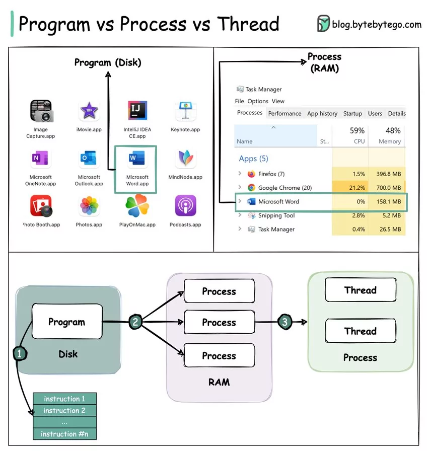

## Đa luồng trong Java

- Đa luồng (Multi-Thread) trong Java là khả năng của một ứng dụng để thực hiện nhiều luồng đồng thời. Thay vì thực hiện công việc tuần tự từ trên xuống dưới, ứng dụng Java có thể chạy nhiều luồng đồng thời, làm cho ứng dụng chạy nhanh và hiệu quả hơn.


- Ví dụ, một ứng dụng nghe nhạc có thể chạy một luồng để phát nhạc và một luồng khác để tải bài hát mới về máy cùng lúc. Điều này giúp người dùng có thể nghe nhạc mà không cần chờ quá lâu để tải bài hát mới.

### Tiến trình (Process)

- Tiến trình là một chương trình đang được thực thi, tức là một chương trình đang hoạt động.

### LUồng (Thread)

- Một luồng(thread) là đơn vị thực thi nhỏ nhất trong một tiến trình.

### Mối quan hệ Process và Thread



- 1. Chương trình chứa 1 tập các instruction.
- 2. Chương trình được nạp vào bộ nhớ, nó trở thành một hoặc nhiều tiến trình đang chạy.
- 3. Khi một tiến trình bắt đầu, nó được gán bộ nhớ và tài nguyên cần thiết. Một tiến trình(process) có thể có 1 hoặc nhiều luồng(thread), nhưng mỗi luồng chỉ thuộc về một tiến trình duy nhất.
- Ví dụ: trong ứng dụng Microsoft Word, một luồng có thể chịu trách nhiệm kiểm tra chính tả và một luồng khác để chèn văn bản vào tài liệu.

### Sự khác biệt Process và Thread

- Các tiến trình thường độc lập, trong khi các luồng tồn tại dưới dạng tập hợp con của một tiến trình.
- Mỗi tiến trình có không gian bộ nhớ riêng. Các luồng thuộc cùng một tiến trình sẽ chia sẻ cùng một bộ nhớ. Vì vậy khi lập trình đa luồng thì cần lưu ý xử lý vấn đề xung đột bộ nhớ.
- Một tiến trình cần nhiều thời gian để tạo và chấm dứt(terminal).
- Chuyển đổi ngữ cảnh thì tốn kém hơn giữa các tiến trình.
- Giao tiếp giữa các luồng thì nhanh hơn.

  https://ant.ncc.asia/su-khac-biet-giua-process-va-thread-la-gi/

## Vòng đời của Thread

Khi một chương trình Java khởi chạy, JVM sẽ tạo ra một thread gọi là main thread, đây là nơi thực thi chương trình. Ngoài main thread, chúng ta có thể tạo thêm các thread khác tùy theo nhu cầu sử dụng.

### Các trạng thái vòng đời của Thread trong Java

- Một thread có các trạng thái sau:
  - NEW (Tạo Mới): Trạng thái khi thread mới được tạo, trước khi gọi start().
  - RUNNABLE (Đang Thực Thi): Thread sẵn sàng để chạy sau khi gọi start().
  - BLOCKED (Bị Chặn): Thread bị chặn khi cố gắng truy cập một đoạn mã đang được chiếm bởi thread khác hoặc khi chờ tài nguyên I/O.
  - WAITING (Chờ): Thread chờ vô thời hạn khi gọi wait() hoặc chờ với thời gian xác định khi gọi sleep().
  - TIMED_WAITING (Chờ Với Thời Gian Xác Định): Thread chờ với thời gian xác định khi gọi wait(timeout) hoặc sleep(timeout).
  - TERMINATED (Chấm Dứt): Thread kết thúc sau khi thực thi xong hoặc xảy ra ngoại lệ.
    

## Tạo Thread trong Java

- Có 2 cách:
  - Extend Thread class
  - Implement Runnable Interface

### Tạo Thread bằng cách thừa kế từ lớp Thread

- Tạo mới một lớp và kế thừa lớp này từ lớp cha Thread.
- Trong lớp mới tạo đó, override phương thức run().
- Cuối cùng, ở nơi khác, khi muốn tạo ra một Thread từ lớp này, khai báo đối tượng cho nó, rồi gọi đến phương thức start() của nó để bắt đầu khởi chạy Thread.

```
public class CountDownThread extends Thread {

    @Override
    public void run() {
        int count = 10;
        for (int i = count; i > 0; i--) {
            System.out.println(i);
            try {
                Thread.sleep(1000);
            } catch (InterruptedException e) {
                // TODO Auto-generated catch block
                e.printStackTrace();
            }
        }
        System.out.println("Hết giờ");
    }
}
```

```
public static void main(String[] args) {
    CountDownThread countDownThread = new CountDownThread();
    countDownThread.start();
}
```

### Tạo Thread bằng cách implement từ Interface Runnable

- Tạo mới một lớp và implement lớp này với interface có tên Runnable, override phương thức run()
- Khi muốn tạo ra một Thread từ lớp này, trước hết khai báo đối tượng cho nó, rồi khai báo thêm một đối tượng của Thread nữa và truyền đối tượng của lớp này vào hàm khởi tạo của Thread.
- Khi phương thức start() của lớp Thread vừa tạo được gọi đến, thì phương thức run() bên trong lớp dẫn xuất của Runnable sẽ được gọi để tạo thành một Luồng trong hệ thống.

```
public class CountDownThread implements Runnable {

    @Override
    public void run() {
        int count = 10;
        for (int i = count; i > 0; i--) {
            System.out.println(i);
            try {
                Thread.sleep(1000);
            } catch (InterruptedException e) {
                // TODO Auto-generated catch block
                e.printStackTrace();
            }
        }
        System.out.println("Hết giờ");
    }
}
```

```
public static void main(String[] args) {
    CountDownThread countDownThread = new CountDownThread();
    Thread thread = new Thread(countDownThread);
    thread.start();
}
```

## Trình lên lịch của Thread (Thread Scheduler)

### Thread Scheduler là gì?

- Trình lên lịch của Thread (Thread scheduler) trong java là một phần của JVM có nhiệm vụ quyết định thread nào nên được chạy.
- Chỉ có một thread tại một thời điểm có thể chạy trong một xử lý duy nhất.
- Thread scheduler chủ yếu sử dụng việc lập kế hoạch ưu tiên hoặc phân chia thời gian để lên lịch các luồng.

### Thread Scheduler hoạt động như nào?

- Có hai yếu tố để lên lịch cho một luồng tức là **Mức độ ưu tiên** và **Thời gian đến**.

  - **Mức độ ưu tiên:** mức độ ưu tiên của mỗi luồng nằm trong khoảng từ 1 đến 10. Nếu một luồng có mức độ ưu tiên cao hơn, điều đó có nghĩa là luồng đó có cơ hội tốt hơn được Trình lên lịch luồng chọn.
  - **Thời gian đến:** giả sử hai luồng có cùng mức độ ưu tiên nhập vào trạng thái chạy được, thì mức độ ưu tiên không thể là yếu tố để chọn một luồng từ hai luồng này. Trong trường hợp này, thời gian đến của luồng được xem xét bởi Trình lên lịch luồng. Một chủ đề đến trước sẽ được ưu tiên hơn các chủ đề khác.

- Ví dụ có các thread được thể hiện ở bảng dưới đây:

Thread Thời gian đến
t1 0
t2 1
t3 2
t4 3
Trong bảng trên, chúng ta có thể thấy rằng Luồng t1 đã đến đầu tiên, sau đó đến Luồng t2, rồi đến t3, và cuối cùng là t4, và thứ tự mà các luồng sẽ được xử lý là theo thời gian đến của các luồng.

