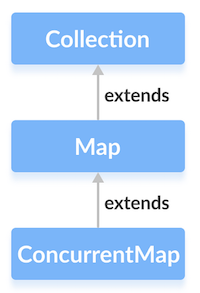

## Race condition

- Race condition xảy ra khi hai hoặc nhiều luồng truy cập dữ liệu chia sẻ và cố gắng thay đổi nó đồng thời. Kết quả cuối cùng phụ thuộc vào thứ tự truy cập, có thể dẫn đến kết quả không nhất quán.

- Ví dụ:

```
class Counter {
    private int count = 0;

    public void increment() {
        count++;
    }

    public int getCount() {
        return count;
    }
}
```

```
public class RaceConditionExample {
    public static void main(String[] args) {
        Counter counter = new Counter();

        Runnable task = () -> {
            for (int i = 0; i < 1000; i++) {
                counter.increment();
            }
        };

        Thread thread1 = new Thread(task);
        Thread thread2 = new Thread(task);

        thread1.start();
        thread2.start();

        try {
            thread1.join();
            thread2.join();
        } catch (InterruptedException e) {
            e.printStackTrace();
        }

        System.out.println("Final count: " + counter.getCount());
    }
}
```

Trong ví dụ trên, hai thread (thread1 và thread2) đều thực hiện việc tăng biến count trong đối tượng Counter. Kết quả cuối cùng của biến count có thể không phải là 2000 như mong đợi, vì các thread có thể truy cập và thay đổi giá trị của count đồng thời, gây ra race condition.

- 1 số cách khắc phục Race Condition:

  - Sử dụng `synchronized`:

    - **Synchronized Methods**: Đánh dấu phương thức bằng từ khóa `synchronized` để đảm bảo rằng chỉ có một luồng được phép truy cập vào phương thức đó tại một thời điểm.

    ```
    public synchronized void synchronizedMethod() {
    // critical section
    }
    ```

    - **Synchronized Blocks**: Đặt đoạn mã cần bảo vệ trong một khối `synchronized` để đồng bộ hóa trên một đối tượng cụ thể.

    ```
    public void someMethod() {
    synchronized(this) {
        // critical section
    }
    }
    ```

  - Sử dụng `Lock`
  - Sử dụng `Atomic Variables`:

    - Các lớp như AtomicInteger, AtomicLong, và AtomicReference cung cấp các phương thức nguyên tử để thực hiện các thao tác mà không cần đồng bộ hóa.

    ```
    import java.util.concurrent.atomic.AtomicInteger;

    public class SomeClass {
        private final AtomicInteger counter = new AtomicInteger(0);

        public void increment() {
            counter.incrementAndGet();
        }

        public int getCounter() {
            return counter.get();
        }
    }
    ```

- Sử dụng `Concurrent Collections`
- Sử dụng `volatile` Keyword: Từ khóa volatile đảm bảo rằng các thay đổi trên biến sẽ được nhìn thấy ngay lập tức bởi các luồng khác.

```
private volatile boolean flag = true;

public void someMethod() {
    while (flag) {
        // do something
    }
}
```

## Lock

- `Lock` cung cấp cơ chế để kiểm soát quyền truy cập vào một tài nguyên chia sẻ bởi nhiều luồng.
- Nó đảm bảo rằng **chỉ có một luồng có thể truy cập tài nguyên tại một thời điểm**, ngăn chặn tình trạng `race condition`.
- Java cung cấp nhiều kiểu khóa khác nhau:

  - `ReentrantLock`: là một loại `lock` (khóa) có khả năng tái nhập (reentrant), có nghĩa là một luồng (thread) có thể nắm giữ nó nhiều lần và chỉ giải phóng khi nó đã được giải phóng bởi tất cả các lần nắm giữ.

  ```
  import java.util.concurrent.locks.ReentrantLock;

    public class ReentrantLockExample {
    private static final ReentrantLock lock = new ReentrantLock();

    public static void main(String[] args) {
        Thread thread1 = new Thread(() -> {
            lock.lock();
            try {
                System.out.println("Thread 1 acquired the lock");
                Thread.sleep(1000); // Simulating some work
            } catch (InterruptedException e) {
                e.printStackTrace();
            } finally {
                lock.unlock();
                System.out.println("Thread 1 released the lock");
            }
        });

        Thread thread2 = new Thread(() -> {
            lock.lock();
            try {
                System.out.println("Thread 2 acquired the lock");
            } finally {
                lock.unlock();
                System.out.println("Thread 2 released the lock");
            }
        });

        thread1.start();
        thread2.start();
    }
    }
  ```

Trong ví dụ này, hai luồng thread1 và thread2 sử dụng cùng một ReentrantLock. Luồng thread1 đầu tiên sẽ nắm giữ lock và sau đó giải phóng nó sau khi hoàn thành công việc. Sau đó, luồng thread2 sẽ nắm giữ và giải phóng lock.

Điểm mạnh của ReentrantLock là bạn có thể kiểm soát được khi nào thả lock bằng cách sử dụng khối try-finally như trong ví dụ trên. Tuy nhiên, bạn cần chắc chắn rằng mọi lần nắm giữ đều _có khối finally để đảm bảo lock được giải phóng_ dù có xảy ra ngoại lệ hay không.

- `ReadWriteLock`:

  - là một giao diện (interface) cho phép bạn có được nhiều đọc cùng một lúc nhưng chỉ một viết duy nhất tại một thời điểm.
  - Điều này hữu ích khi bạn có một tập dữ liệu mà nhiều luồng (thread) có thể đọc cùng một lúc nhưng chỉ một luồng có thể thay đổi nó vào một thời điểm nhất định.
  - `ReadWriteLock` có hai loại lock bên trong:
    - `ReadLock`: Cho phép nhiều luồng cùng nắm giữ để đọc dữ liệu.
    - `WriteLock`: Yêu cầu lock độc quyền để thay đổi dữ liệu.
  - `ReadWriteLock` cho phép nhiều luồng đọc cùng một lúc (nếu không có ai đang viết), nhưng chỉ một luồng có thể viết một lúc. Khi không có luồng nào đang viết, nhiều luồng có thể đọc cùng lúc.

  ```
  import java.util.concurrent.locks.ReadWriteLock;
  import java.util.concurrent.locks.ReentrantReadWriteLock;

    public class ReadWriteLockExample {
    private static final ReadWriteLock lock = new ReentrantReadWriteLock();
    private static int data = 0;

    public static void main(String[] args) {
        Thread writerThread = new Thread(() -> {
            lock.writeLock().lock();
            try {
                System.out.println("Writer thread is writing data.");
                data++; // Modifying the shared resource
                Thread.sleep(1000); // Simulating some write operation
            } catch (InterruptedException e) {
                e.printStackTrace();
            } finally {
                lock.writeLock().unlock();
                System.out.println("Writer thread released the write lock.");
            }
        });

        Thread readerThread = new Thread(() -> {
            lock.readLock().lock();
            try {
                System.out.println("Reader thread is reading data: " + data); // Reading the shared resource
                Thread.sleep(1000); // Simulating some read operation
            } catch (InterruptedException e) {
                e.printStackTrace();
            } finally {
                lock.readLock().unlock();
                System.out.println("Reader thread released the read lock.");
            }
        });

        writerThread.start();
        readerThread.start();
    }

    }

  ```

  Trong ví dụ này, writerThread nắm giữ WriteLock để thay đổi dữ liệu (data), trong khi readerThread nắm giữ ReadLock để đọc dữ liệu

- `StampedLock`:

  - `StampedLock` là một loại khóa mới được giới thiệu trong Java 8, cung cấp các cơ chế khóa optimistic (lạc quan) ngoài các cơ chế khóa read/write thông thường.
    - Reading lock (Khóa đọc): Cho phép nhiều luồng cùng đọc dữ liệu.
    - Writing lock (Khóa ghi): Yêu cầu lock độc quyền để thay đổi dữ liệu.
    - Optimistic reading lock (Khóa đọc lạc quan): Không đảm bảo nhất quán, nhưng cung cấp khả năng kiểm tra nhẹ mà không cần phải chờ đợi.
  - `StampedLock` hỗ trợ cơ chế "đánh dấu" (`stamp`), mỗi lần khóa được yêu cầu, nó sẽ trả về một giá trị stamp (giá trị `long`) mà bạn có thể sử dụng để _kiểm tra xem dữ liệu có thay đổi từ lúc bạn nhận stamp đến lúc bạn sử dụng stamp đó hay không_.

  ```
  import java.util.concurrent.locks.StampedLock;

    public class StampedLockExample {
    ExecutorService executor = Executors.newFixedThreadPool(2);
    StampedLock lock = new StampedLock();

    executor.submit(() -> {
    long stamp = lock.tryOptimisticRead();
    try {
        System.out.println("Optimistic Lock Valid: " + lock.validate(stamp));
        sleep(1);
        System.out.println("Optimistic Lock Valid: " + lock.validate(stamp));
        sleep(2);
        System.out.println("Optimistic Lock Valid: " + lock.validate(stamp));
    } finally {
        lock.unlock(stamp);
    }
    });

    executor.submit(() -> {
    long stamp = lock.writeLock();
    try {
        System.out.println("Write Lock acquired");
        sleep(2);
    } finally {
        lock.unlock(stamp);
        System.out.println("Write done");
    }
    });

    stop(executor);
    }
  ```

  Kết quả:

  ```
  Optimistic Lock Valid: true
  Write Lock acquired
  Optimistic Lock Valid: false
  Write done
  Optimistic Lock Valid: false
  ```

  - Phương thức `tryConvertToWriteLock(long stamp)` trong `StampedLock` trong Java được sử dụng để cố gắng chuyển đổi một lock hiện tại từ khóa đọc (reading lock) hoặc khóa đọc lạc quan (optimistic reading lock) sang khóa ghi (writing lock). Phương thức này trả về một stamp mới nếu việc chuyển đổi thành công, hoặc trả về 0 nếu không thành công.
    => nâng cấp lock hiện tại của mình mà không cần phải giải phóng và yêu cầu lại từ đầu, giảm thiểu thời gian chờ đợi và cải thiện hiệu suất
    https://medium.com/@aayushbhatnagar_10462/java-concurrency-through-stamped-locks-eb65e9a675c1

## Volatile

- `Volatile` được sử dụng để khai báo một biến có thể được truy cập và sửa đổi bởi nhiều luồng mà không cần đồng bộ hóa.
- Khi một biến được khai báo là `volatile`, nó đảm bảo rằng bất kỳ thay đổi nào đối với biến này sẽ được nhìn thấy ngay lập tức bởi tất cả các luồng.

- Đặc điểm:
  - _Truy Cập Trực Tiếp đến Bộ Nhớ Chính:_ Các biến `volatile` được đọc và ghi trực tiếp từ bộ nhớ chính. Điều này đảm bảo rằng giá trị của biến luôn được cập nhật và nhất quán giữa các luồng.
  - _Không Có Bộ Nhớ Đệm:_ Các biến `volatile` không được lưu trữ trong bộ nhớ đệm CPU hoặc bộ nhớ đệm của các luồng. Điều này tránh được vấn đề về tính nhất quán của bộ nhớ mà thường gặp phải trong các ứng dụng đa luồng.
  - _Không Cần Đồng Bộ Hóa_: Sử dụng `volatile` giúp tránh việc phải sử dụng các cơ chế đồng bộ hóa phức tạp như `synchronized` hoặc `ReentrantLock`.

```
public class VolatileExample {
    private static volatile boolean flag = false;

    public static void main(String[] args) {
        // create and start a new thread
        new Thread(() -> {
            while (!flag) {
                // do some work
            }
            System.out.println("Thread finished");
        }).start();

        // set the flag to true after a delay
        try {
            Thread.sleep(1000);
        } catch (InterruptedException e) {
            e.printStackTrace();
        }
        flag = true;
    }
}
```

```
Thread finished
```

## Atomic

-
- Biến nguyên tử (`atomic variable`) là các biến cung cấp các thao tác nguyên tử để cập nhật và lấy giá trị trên các _kiểu dữ liệu nguyên thủy_ như int, long, double, v.v..
- Chúng đảm bảo rằng các thao tác này được thực hiện một cách an toàn trong môi trường đa luồng mà không cần sử dụng đồng bộ hóa (`synchronization`) hoặc khóa (`locks`)
- Các lớp nguyên tử sử dụng `compare and swap (CAS)`, được hỗ trợ hầu hết trong các CPU hiện đại.
  https://howtodoinjava.com/java/multi-threading/compare-and-swap-cas-algorithm/

- `Atomic` bên trong sử dụng kiểu `private volatile int value;`

- Các loại biến atomic class:
  - AtomicBoolean
  - AtomicInteger
  - AtomicIntegerAray
  - AtomicLong
  - AtomicLongArray
  - LongAdder
  - LongAccumulator
    ...

### AtomicInteger

- Bằng cách sử dụng `AtomicInteger` để thay thế cho `Integer`, có thể tăng số lượng đồng thời 1 cách an toàn theo luồng (`thread safe`) mà không cần đồng bộ hóa quyền truy cập vào biến.

```
import java.util.concurrent.atomic.AtomicInteger;

public class AtomicCounter {
    private AtomicInteger counter = new AtomicInteger(0);

    public void increment() {
        counter.incrementAndGet();
    }

    public int getCounter() {
        return counter.get();
    }
}
```

## Concurrent HashMap

- `ConcurrentMap` là một interface trong Java, mở rộng từ Map và cung cấp các phương thức để thực hiện các thao tác đọc và ghi an toàn trong môi trường đa luồng mà không cần sử dụng `synchronized` hoặc các khóa đồng bộ khác.



- Để sử dụng các chức năng của `ConcurrentMap` interface, chúng ta cần sử dụng class `ConcurrentHashMap` để triển khai nó.

```
// ConcurrentMap implementation by ConcurrentHashMap
CocurrentMap<Key, Value> numbers = new ConcurrentHashMap<>();
```

- Các phương thức Atomic trong ConcurrentHashMap:

  - _putIfAbsent(K key, V value)_

    - Thêm một cặp key-value vào map nếu key chưa tồn tại.
    - Trả về giá trị của key nếu key đã tồn tại; nếu không, trả về null.

  - _remove(Object key, Object value)_

    - Xóa phần tử với key và value chỉ định nếu tồn tại.
    - Trả về true nếu phần tử được xóa thành công; nếu không, trả về false.

  - _replace(K key, V oldValue, V newValue)_

    - Thay thế giá trị của key nếu key đã tồn tại và giá trị hiện tại của key là oldValue.
    - Trả về true nếu thay thế thành công; nếu không, trả về false.

  - _computeIfAbsent(K key, Function<? super K, ? extends V> mappingFunction)_

    - Nếu key chưa tồn tại, tính toán giá trị mới bằng cách sử dụng mappingFunction và thêm vào map.
    - Trả về giá trị của key sau khi tính toán.

  - _computeIfPresent(K key, BiFunction<? super K, ? super V, ? extends V> remappingFunction)_

    - Nếu key đã tồn tại, tính toán giá trị mới bằng cách sử dụng remappingFunction và thay thế giá trị hiện tại của key.
    - Trả về giá trị mới của key sau khi tính toán.

  - _compute(K key, BiFunction<? super K, ? super V, ? extends V> remappingFunction)_

    - Tính toán giá trị mới của key bằng cách sử dụng remappingFunction và thay thế giá trị hiện tại của key (nếu key đã tồn tại).
    - Trả về giá trị mới của key sau khi tính toán.

  - _merge(K key, V value, BiFunction<? super V, ? super V, ? extends V> remappingFunction)_

    - Kết hợp giá trị mới với giá trị hiện tại của key (nếu key đã tồn tại) bằng cách sử dụng remappingFunction.
    - Trả về giá trị mới của key sau khi kết hợp.

## Virtual Thread

- Java 21 giới thiệu virtual threads, những luồng nhẹ nhằm làm cho lập trình đồng thời trở nên dễ dàng và mở rộng hơn. Virtual threads được quản lý bởi Java runtime, cho phép tạo ra hàng ngàn hay thậm chí hàng triệu luồng mà không gây quá tải đáng kể.

```

public class VirtualThreadExample {
public static void main(String[] args) {
for (int i = 0; i < 1000; i++) {
Thread.startVirtualThread(() -> {
System.out.println("Running in a virtual thread: " + Thread.currentThread());
});
}
}
}

```

- Virtual threads cung cấp một mô hình đơn giản hơn cho xử lý đồng thời, làm cho việc viết và duy trì các ứng dụng đồng thời trở nên dễ dàng hơn mà không cần lo lắng về quản lý luồng và hạn chế tài nguyên.

https://viblo.asia/p/virtual-threads-nen-tang-moi-cho-ung-dung-java-quy-mo-lon-5pPLkxA8VRZ
