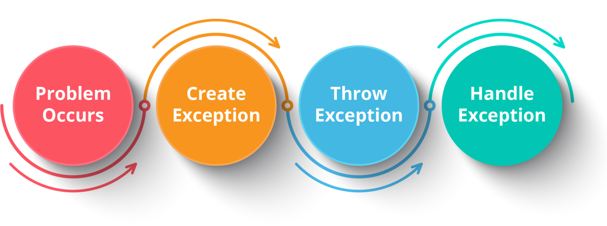

## Exception

- Trong java, Exception là một sự kiện làm gián đoạn luồng bình thường của chương trình. Nó là một đối tượng được ném ra tại runtime.

## Lợi ích

- Việc xử lý ngoại lệ giúp duy trì luồng bình thường của ứng dụng.

## Hệ thống các lớp ngoại lệ trong Java


## Các kiểu ngoại lệ


- Checked Exception:
  - Là một ngoại lệ được kiểm tra và thông báo bởi trình biên dịch tại thời điểm biên dịch, chúng cũng có thể được gọi là ngoại lệ thời gian biên dịch (Compile-time Exceptions).
  - Ví dụ: Bạn muốn mở một file để đọc nhưng tệp được chỉ định lại không tồn tại. Thì FileNotFoundExeption sẻ xảy ra và trình biên dịch sẽ thông báo tới lập trình viên nhằm xử lý ngoại lệ đó.
- Unchecked Exception:
  - Là một ngoại lệ không được kiểm tra trong quá trình biên dịch, chỉ xảy ra ở runtime.
  - Unchecked Exceptions kế thừa từ Runtime Exception.
  - Ví dujL ArithmaticException, ArrayIndexOutOfBoundsException, NullPointerException,…chúng được kiểm tra tại Runtime.

## Xử lý ngoại lệ (Exeption Handling)

- Exception Handling (xử lý ngoại lệ) là một cơ chế xử lý các lỗi runtime như ClassNotFound, IO, SQL, Remote



- Exception Handling được thực hiện bằng try/catch block.


- Nếu trong try block xảy ra Exception, code trong try sẽ không được thực thi nữa. JVM sẽ tìm kiếm catch block có xử lý Exception đó.
- Nếu không có catch block hay catch block không xử lý đúng Exception bị throw, code thực thi finally block và ngắt Thread hiện tại.
- Nếu catch block xử lý đúng Exception, code tiếp tục thực thi đến khi hết catch, sau đó finally thực thi Thread như thông thường.

- Một số lưu ý:
  
  - Khi code trong try block throw Exception, các catch sẽ được check theo thứ tự thực thì.
  - Khi 1 catch block đã được thực thi, các catch block theo sau sẽ bị bỏ qua.
  - Các catch nên được sắp xếp để xử lý theo thứ từ Exception con tới Exception cha. Ví dụ: chúng ta nên catch NumberFormatException trước khi catch Exception.
  - Khối finally luôn được thực hiện dù Exception có được catch hay không. Nó sẽ không được thực thi khi System.exit() được gọi hay Error mà môi trường không xử lý được xảy ra.
  - Đối với mỗi try block, có thể không có hoặc có 1 hoặc nhiều catch block nhưng sẽ chỉ có 1 finally block.

## Exception Keywords

Java các keywords thường dùng để xử lý các exception


## Sự khác nhau giữa hai từ khóa "throw" và "throws" trong Java?

- Throw:
  - Được sử dụng để ném ra một ngoại lệ cụ thể.
  - Chúng ta có thể ném một trong hai ngoại lệ checked hoặc unchecked trong java bằng từ khóa này.
  - Từ khóa throw chủ yếu được sử dụng để ném ngoại lệ do người dùng tự định nghĩa.

```
	public static void main(String[] args) {
		ageValid(19);
		System.out.println("------");
		ageValid(17);
	}

	public static void ageValid(int age) {
		if (age < 18) {
			throw new ArithmeticException("Age not valid!");
		} else {
			System.out.println("Welcome!");
		}
	}
```

Kết quả:

```
Welcome!
------
Exception in thread "main" java.lang.ArithmeticException: Age not valid!
	at exception.ThrowExceptionExample.ageValid(ThrowExceptionExample.java:13)
	at exception.ThrowExceptionExample.main(ThrowExceptionExample.java:8)
```

- Throws:
  - Được sử dụng để khai báo một ngoại lệ.
  - Nó thông báo cho lập trình viên rằng một ngoại lệ có thể xảy ra. Ngoại lệ checked được truyền ra ngay cả khi chỉ sử dụng từ khóa throws.
  - Throws được khai báo ngay sau dấu đóng ngoặc đơn của phương thức.

## Các phương thức exception (Exception method)

1 vài phương thức có sẵn quan trọng trong class Throwable


## Tự tạo exception

- Tự tạo exception (Custom Exception) là một loại ngoại lệ do bạn tự định nghĩa hoặc tạo riêng cho ứng dụng của
- Ví dụ:
  Để tạo một Custom Exception trong Java, bạn cần tạo một lớp kế thừa từ lớp Exception hoặc các lớp con của nó.

Custom Exception

```
class InvalidAgeException extends Exception {
    InvalidAgeException(String s) {
        super(s);
    }
}

```

Sử dụng Custom Exception

```
class TestCustomException {

    static void validate(int age) throws InvalidAgeException {
        if (age < 18)
            throw new InvalidAgeException("Tuổi không hợp lệ");
        else
            System.out.println("Chào mừng bạn đã đủ tuổi bầu cử");
    }

    public static void main(String args[]) {
        try {
            validate(13);
        } catch (InvalidAgeException e) {
            System.out.println("Xảy ra ngoại lệ: " + e.getMessage());
        }

        System.out.println("Phần còn lại của mã...");
    }
}
```

Kết quả:

```
Xảy ra ngoại lệ: Tuổi không hợp lệ
Phần còn lại của mã...
```
