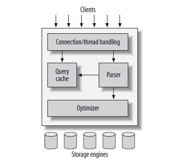
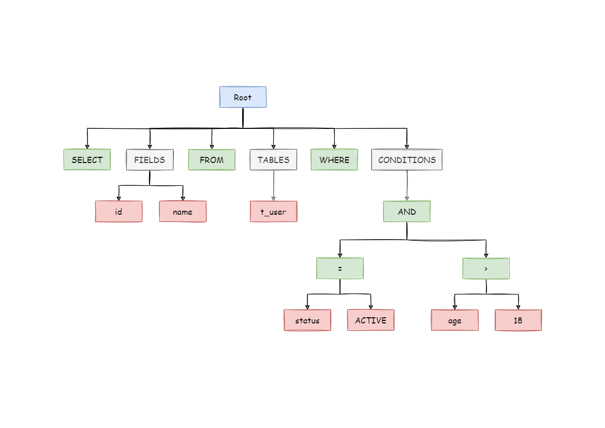

Yêu cầu (1): Tự cài đặt một cơ sở dữ liệu trên máy tính (cụ thể là mysql). trình bày chi tiết về các thành phần liên quan (vật lí - parser, optimizer, các loại storage engine, ...)

Kiến trúc logic của **MySQL** nhìn tổng quan có thể được mô tả như hình dưới đây:

Ta có thể thấy MySQL có các component cơ bản như ở dưới đây:

- Connection/thread handling.
  - Query cache.
  - Parser.
  - Optimizer.
  - Storage engine.

## Query cache

- `Query Cache` là một tính năng cho phép lưu trữ kết quả của các câu lệnh `SELECT` vào bộ nhớ cache, để các câu lệnh `SELECT` có cùng cấu trúc và các tham số truy vấn tương tự có thể được trả về từ bộ nhớ cache mà không cần thực thi lại câu lệnh truy vấn đến cơ sở dữ liệu.
  => Điều này giúp cải thiện hiệu suất của hệ thống bằng cách giảm thời gian xử lý và tải cho cơ sở dữ liệu.
  https://hocvps.com/toi-uu-mysql-query-cache/
  https://www.digitalocean.com/community/tutorials/how-to-optimize-mysql-with-query-cache-on-ubuntu-18-04
  https://dev.mysql.com/doc/refman/5.7/en/query-cache-operation.html

## Parser

## Optimizer

## Storage engine

### MyISAM engine

### InnoDB engine

### Memory engine

### Archive engine

### CSV engine

### Falcon engine

### Maria engine (Cơ sở dữ liệu liên quan: MariaDB)

https://rivercrane.vn/blog/technical/gioi-thieu-mot-so-storage-engine-cua-mysql-1055/
https://viblo.asia/p/toi-uu-hoa-co-so-du-lieu-va-tinh-chinh-cau-truy-van-trong-mysql-vyDZO3mOZwj

how to query cache in mysql work
https://www.youtube.com/results?search_query=how+to+query+cache+in+mysql+work

