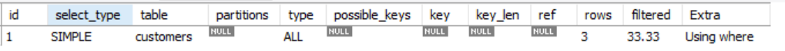
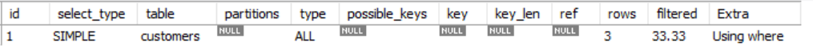

Yêu cầu (2): Tự lấy ví dụ về 10 câu query mySQL không tốt và cách tối ưu nó (minh họa bằng explain).


## Tối ưu hóa câu truy vấn

- **Sử dụng Index (Chỉ mục)**

Ví dụ: Tạo chỉ mục trên cột user_id trong bảng users để tăng tốc độ truy vấn khi lấy thông tin của một người dùng cụ thể.

```
CREATE INDEX idx_user_id ON users(user_id);
SELECT * FROM users WHERE user_id = 123;
```

- **Tránh sử dụng SELECT \***
  Việc sử dụng câu lệnh SELECT \* có thể làm chậm hiệu suất truy vấn vì nó trả về tất cả các cột trong một bảng, bao gồm cả những cột không cần thiết cho truy vấn. Để tối ưu hóa các truy vấn SQL, điều quan trọng là chỉ chọn các cột cần thiết cho truy vấn.
- **Sử dụng EXISTS thay vì IN**
  Một giá trị được so sánh với danh sách các giá trị được truy vấn con trả về bằng toán tử IN. Tuy nhiên, việc sử dụng IN có thể làm chậm hiệu suất truy vấn vì nó yêu cầu cơ sở dữ liệu thực hiện quét toàn bộ bảng trên truy vấn con. Để tối ưu hóa các truy vấn SQL, bạn có thể sử dụng toán tử EXISTS thay vì IN.

```
SELECT *
FROM users u
WHERE EXISTS (
    SELECT 1
    FROM orders o
    WHERE o.user_id = u.user_id
);
```

- **Tối ưu hóa JOIN và Subquery**

Sử dụng INNER JOIN thay vì subquery để kết nối dữ liệu từ các bảng khác nhau

- **Hạn chế tối đa việc sử dụng ký tự đại diện**

  - Việc sử dụng các ký tự đại diện , chẳng hạn như % và \_, trong truy vấn SQL, có thể làm chậm hiệu suất truy vấn. Khi sử dụng ký tự đại diện, cơ sở dữ liệu phải quét toàn bộ bảng để tìm dữ liệu liên quan. Để tối ưu hóa các truy vấn SQL, điều quan trọng là giảm thiểu việc sử dụng các ký tự đại diện và chỉ sử dụng chúng khi thực sự cần thiết.

  - Ví dụ: hãy xem xét một truy vấn để xác định tất cả các khách hàng trong thành phố có họ bắt đầu bằng chữ cái “P”. Truy vấn sau đây sử dụng ký tự đại diện để tìm tất cả các record khớp với yêu cầu:

    ```
    SELECT * FROM customers WHERE last_name_city LIKE 'P%';
    ```

    Truy vấn vẫn sẽ hoạt động nhưng sẽ chậm hơn khi sử dụng index trên cột Last_name_city. Truy vấn có thể được cải thiện bằng cách thêm index vào cột Last_name_city và viết lại như sau:

    ```
    SELECT * FROM customers WHERE last_name_city >= 'P' AND last_name < 'Q';
    ```

## Index

## Explain


Mỗi hàng trong EXPLAIN chứa các cột sau:

- **id**: Là số thứ tự cho mỗi câu SELECT trong truy vấn

  - **1**: Đây là bảng được chọn làm đầu tiên để thực hiện truy vấn. MySQL sẽ bắt đầu từ bảng này và sau đó thực hiện các bước join hoặc các phép nối khác để lấy dữ liệu từ các bảng khác.
  - **2, 3, 4, ...**: Các con số tiếp theo thường chỉ ra thứ tự thực hiện các bước join hoặc các phép nối khác để kết hợp dữ liệu từ các bảng khác nha
  - **NULL**: Trường hợp này thường xảy ra khi câu lệnh truy vấn sử dụng các phương pháp khác ngoài join, ví dụ như UNION hoặc các loại truy vấn phụ (subquery), và không có thứ tự cụ thể giữa các bảng.

- **SELECT_TYPE**: Loại của câu `SELECT`

  - `SIMPLE` - Truy vấn là một câu `SELECT` cơ bản, không có bất cứ truy vấn con (subqueries) hay câu lệnh hợp (`UNION`) nào.
  - `PRIMARY` - Truy vấn là câu `SELECT` ngoài cùng của một lệnh `JOIN`. -
  - `DERIVED` - Truy vấn là một truy vấn con của truy vấn khác, nằm trong lệnh `FROM`.
  - `SUBQUERY` - Truy vấn đầu tiên của một truy vấn con.
  - `DEPENDENT SUBQUERY` - Truy vấn con, phụ thuộc vào một truy vấn khác bên ngoài nó.
  - `UNCACHEABLE SUBQUERY` - Truy vấn không thể lưu lại được (có quy định điều kiện cụ thể, thế nào là một truy vấn có thể lưu lại được).
  - `UNION` - Truy vấn là câu `SELECT` thứ hai của lệnh `UNION`.
  - `DEPENDENT UNION` - Truy vấn thứ hai hoặc các truy vấn tiếp theo của lệnh `UNION` phụ thuộc vào một truy vấn bên ngoài.
  - `UNION RESULT` - Truy vấn là kết quả của lệnh `UNION`.

- **TABLE**: Bảng liên quan đến câu truy vấn.
- **TYPE**: Cách MySQL join các bảng lại với nhau. Đây có thể coi là trường quan trọng nhất trong kết quả của explain. Nó có thể chỉ ra các index bị thiếu và nó cũng có thể cho thấy câu truy vấn của bạn cần phải xem xét lại.

  - `system` - Bảng có 0 hoặc 1 dòng
  - `const` - Bảng chỉ có duy nhất 1 dòng đã được đánh chỉ mục mà khớp với điều kiện tìm kiếm. Đây là loại join nhanh nhất, bởi bảng chỉ cần đọc một lần duy nhất và giá trị của cột được xem như là hằng số khi join với các bảng khác.
  - `eq_ref` - Giống như const nhưng trường được sử dụng không đứng riêng mà nằm trong câu lệnh JOIN. Đây là loại join tốt thứ hai chỉ sau const.
  - `ref` - Khi trường được tìm kiếm có được đánh index , tuy nhiên trường đó không phải là UNIQUE. Kiểu join này thường xảy ra với các cột được so sánh với toán tử = hoặc <=>
  - `fulltext` - Phép join các bảng sử dụng FULLTEXT index
  - `ref_or_null` - Gần giống như ref nhưng chứa cả các dòng với cột mang giá trị null
  - `index_merge` - Phép join sử dụng một danh sách các index để đưa ra tập kết quả. Ở cột KEY sẽ liệt kê các key được sử dụng
  - `unique_subquery` - Truy vấn con với lệnh IN sẽ trả về duy nhất một kết quả và sử dụng primary key
  - `index_subquery` - Gần giống như unique_subquery nhưng trả về nhiều hơn một dòng
  - `range` - Một index được sử dụng để tìm các hàng phù hợp trong một khoảng xác định khi khóa được so sánh với hằng số thông qua các toán tử BETWEEN, IN, >, >=,...
  - `index` - Toàn bộ cây index được duyệt để tìm ra row thỏa mãn điều kiện, do đó sẽ rất chậm
  - `all` - Toàn bộ bảng được quét để tìm ra các hàng phù hợp cho join. Kiểu join này được coi là tệ nhất và thường cho thấy việc thiếu các index trên các bảng

- **possible_keys**: Hiển thị `keys` có thể được dùng bởi MySQL để tìm dòng trong bảng, tuy nhiên nó có thể hoặc không thể được dùng
- **key**: `Key` được chính thức MySql sử dụng để làm index để tìm kiếm. Cột này có thể chứa khóa không được liệt kê ở cột `possible_keys`
- **len_key**: Chiều dài của khóa mà trình tối ưu truy vấn (Query Optimizer) sử dụng. Nó phụ thuộc vào kiểu dữ liệu và các thuộc tính của cột. Ví dụ, key_len mang giá trị 4 có nghĩa là nó cần bộ nhớ để lưu 4 ký tự.
- **ref**: Tên cột hoặc hằng số được dùng để so sánh với chỉ mục được nêu ra ở cột `key`. MySQL có thể lấy ra một hằng số, hoặc một cột cho quá trình thực hiện truy vấn
- **rows**: Số lượng bản ghi đã được duyệt để trả về kết quả. Đây cũng là một cột hết sức quan trọng cho việc tối ưu truy vấn, nhất là khi bạn dùng JOIN hoặc truy vấn con.
- **filtered**: Hiển thị tỷ lệ phần trăm các hàng từ bảng đó mà dự kiến sẽ vượt qua được các điều kiện WHERE trong câu truy vấn. Ví dụ, nếu cột filter là 10.00, điều đó có nghĩa là MySQL dự kiến khoảng 10% các hàng sẽ vượt qua các điều kiện WHERE.
- **Extra**: Các thông tin bổ sung liên quan đến quá trình thực hiện truy vấn. Các giá trị kiểu như Using Temporary (dùng tạm thời), Using filesort (dùng sắp xếp file),... của cột này có thể cho thấy một truy vấn không thực sự tốt.

  https://viblo.asia/p/su-dung-explain-de-toi-uu-cau-lenh-mysql-BYjv44gmvxpV
  https://www.eversql.com/mysql-explain-example-explaining-mysql-explain-using-stackoverflow-data/

## Ví dụ về 10 câu query mySQL

### Ví dụ 1

- Câu query không tốt:

```
SELECT \* FROM users WHERE username = 'john';
```

.

- Nhận xét:

  - `type`: `All` có nghĩa là truy vấn toàn bộ bảng (full table scan).

  - `rows`: Số hàng được quét, ở đây là 3 (toàn bộ bảng).

- Tối ưu:

```
CREATE INDEX idx_username ON users(username);
SELECT \* FROM users WHERE username = 'john';
```


- Nhận xét:

  - `type`: Loại truy vấn, `ref` có nghĩa là sử dụng index để tìm kiếm.

  - `rows`: Số hàng được quét, ở đây là 1 (chỉ quét hàng có username là 'john').

- Kết luận:
  - Trước khi tạo index, truy vấn phải quét toàn bộ bảng users.
  - Sau khi tạo index trên cột username, MySQL có thể sử dụng index để tìm kiếm nhanh hơn, chỉ quét đúng hàng có username là 'john'.
  - Điều này giảm đáng kể số lượng hàng được quét và tăng tốc độ truy vấn.

### Ví dụ 2

- Câu query không tốt:

```
SELECT * FROM orders o, customers c WHERE o.customer_id = c.customer_id;
```


- Tối ưu:

```
alter table orders add index(customer_id);
alter table customers add index(customer_id);
SELECT * FROM orders o INNER JOIN customers c ON o.customer_id = c.customer_id;
```


### Ví dụ 3

- Câu query không tốt:

```
SELECT * FROM customers WHERE email LIKE 'j%';
```



- Tối ưu:

```
alter table customers add index(email);
SELECT * FROM customers WHERE email LIKE 'j%';
```


### Ví dụ 4

```
alter table customers add index (email);
```

- Câu query không tốt:

```
 SELECT * FROM customers WHERE email LIKE '%j';
```



- Tối ưu:

```
SELECT * FROM customers WHERE email LIKE 'j%';
```


### Ví dụ 5

- Câu query không tốt:

```
select * from orders  ORDER BY amount desc limit 2 ;
```


- Tối ưu:

```
alter table orders add index idx_amount(amount);
explain select * from orders  ORDER BY amount desc limit 2 ;
```


### Ví dụ 6

Ban đầu có

```
alter table products add index idx_category(category);
```

- Câu query không tốt:

```
select * from products   where category = 'Electronics' and name = "Laptop X";
```


- Tối ưu:

```
alter table products drop index idx_category;
alter table products add index idx_multi(category, name);

select * from products where category = 'Electronics' and name = "Laptop X";
```


### Ví dụ 7

Ban đầu có

```
alter table products add index idx_multi(category, name);
```

- Câu query không tốt:

```
select * from products   where  name = "Laptop X" ;
```

- Tối ưu:

```
alter table products drop index idx_multi;
alter table products add index idx_multi(name, category);

select * from products   where  name = "Laptop X" and category = 'Electronics' ;
```


### Ví dụ 8

- Câu query không tốt:

```
SELECT * FROM USERs WHERE MONTH(registration_date) = 1;
```


- Tối ưu:

```
alter table USERs add index idx_month_reg_date((MONTH(registration_date)));

SELECT * FROM USERs WHERE MONTH(registration_date) = 1;
```


### Ví dụ 9

- Câu query không tốt:

```
select * from products where category = 'Electronics' order by price;
```


- Tối ưu:

```
alter table products add index idx_multi(category, price);

select * from products where category = 'Electronics' order by price;
```


### Ví dụ 10

- Câu query không tốt:

````
Select * from products where name like '%laptop%' or description like '%laptop%';```

- Tối ưu:

````

Alter table products ADD FULLTEXT idx_fulltext(name, description);

Select \* from products where match(name, description) AGAINST ('laptop');

```

- Ref:
  - https://medium.com/datadenys/using-explain-in-mysql-to-analyze-and-improve-query-performance-f58357deb2aa
  - https://blog.devops.dev/sql-query-optimization-with-10-proven-techniques-for-enhanced-performance-b806e4952e46
  - https://planetscale.com/learn/courses/mysql-for-developers/indexes/fulltext-indexes?autoplay=1
  - https://youtu.be/YuRO9-rOgv4?si=DzF_4Frbxpw2IZoY
```
