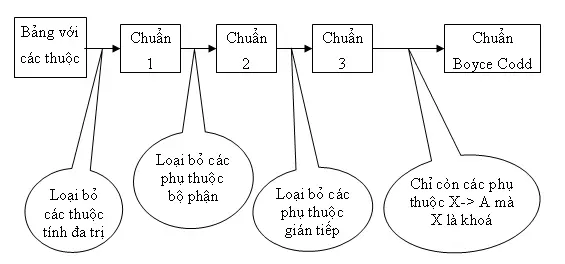
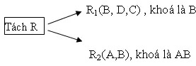
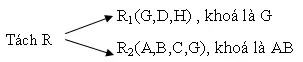

Yêu cầu (3): Tìm hiểu về các loại db và trình bày lại (ít nhất 3 db thuộc loại sql, 3 db thuộc loại no sql). các khái niệm CAP, BASE, ACID, 3 dạng chuẩn của csdl.

## Cơ sở dữ liệu quan hệ (Relational Database):

- Cơ sở dữ liệu quan hệ cũng là dạng database được sử dụng phổ biến nhất.
- Mối quan hệ của các dữ liệu giúp dễ dàng quản lý và chúng được liên hệ dưới dạng bảng trực quan.
- Một số hệ quản trị cơ sở dữ liệu hỗ trợ điển hình như MySQL, PostgreSQL, Oracle, MS SQL Server,..

### MySQL

- MySQL là máy chủ cơ sở dữ liệu SQL mã nguồn mở, phổ biến và dễ sử dụng nhất được sử dụng rộng rãi để phát triển ứng dụng web.

- MySQL tuân thủ hệ thống ACID để đảm bảo tính nhất quán trong giao dịch và cung cấp nhiều Connectors và API khác nhau như C, C++, Java, PHP,...

### PostgreSQL

- PostgreSQL là mã nguồn mở (open-source) và không bị kiểm soát bởi bất kỳ doanh nghiệp nào mà được xuất bản trên Github.

- Không giống PostgreSQL là một hệ thống quản lý cơ sở dữ liệu có cấu trúc đối tượng (ORDBMS) được thiết kế để hỗ trợ các mô hình dữ liệu phức tạp và đa dạng hơn.

- Ưu điểm:
  - Điểm nổi bật nhất của PostgreSQL chính là khả năng mở rộng theo chiều dọc và tuân thủ các tiêu chuẩn ACID.

### Oracle Database

- Là một hệ quản trị cơ sở dữ liệu mạnh mẽ, cung cấp tính năng ACID, hỗ trợ quản lý dữ liệu lớn và các tính năng quản lý cao cấp.
- Hỗ trợ quản lý dữ liệu có cấu trúc và không cấu trúc, lưu trữ dữ liệu theo cấu trúc bảng và mối quan hệ giữa chúng.

## Cơ sở dữ liệu NOSQL

- Cơ sở dữ liệu NoSQL cũng thuộc trong những dạng database quen thuộc.
- Dạng database này giúp cho việc quản lý dữ liệu lớn dễ dàng và phân tích hiệu quả hơn.
- Một số hệ quản trị cơ sở dữ liệu hỗ trợ điển hình như Apache Cassandra, MongoDB, CouchDB, and CouchBase, Redis

### MongoDB

- MongoDB là một hệ quản trị cơ sở dữ liệu NoSQL dạng tài liệu (JSON), được sử dụng phổ biến cho các ứng dụng web, lưu trữ dữ liệu phi cấu trúc và Internet vạn vật (IoT).

### Redis

- Redis là một hệ quản trị cơ sở dữ liệu NoSQL dạng khóa-giá trị (key-value) được sử dụng phổ biến cho hệ thống cache, hệ thống nhắn tin và bảng xếp hạng

- Ví dụ:
  - Khóa: user:1
    Giá trị:
    name: "John Doe"
    email: "[đã xoá địa chỉ email]"
    address: "123 Main Street"

### Cassandra

- Cassandra là một hệ quản trị cơ sở dữ liệu NoSQL dạng cột (wide-column) được sử dụng phổ biến cho dữ liệu lớn và phân tích dữ liệu.

https://www.geeksforgeeks.org/types-of-databases/
https://aptech.fpt.edu.vn/database-la-gi.html

### So sánh sql và nosql

|               | SQL                                                    | NoSQL                                       |
| ------------- | ------------------------------------------------------ | ------------------------------------------- |
| Kiểu dữ liệu  | Cấu trúc                                               | Không cấu trúc, bán cấu trúc                |
| Mô hình       | Quan hệ                                                | Key-Value, Document, Wide-Column, Graph     |
| ACID/BASE     | ACID                                                   | BASE                                        |
| Phân tán      | Không tự nhiên                                         | Tự nhiên                                    |
| Thích hợp với | Dữ liệu phức tạp, nghiệp vụ yêu cầu tính nhất quán cao | Dữ liệu lớn, phân tán, nhanh chóng thay đổi |

## CAP

- Ba đặc điểm của hệ thống phân tán mà định lý `CAP` đề cập đến:
  - `Tính nhất quán (Consistency)`: Đảm bảo rằng tất cả các bản sao dữ liệu trong hệ thống đều phản ánh trạng thái mới nhất sau khi thực hiện bất kỳ thao tác nào.
  - `Tính khả dụng (Availibility)`: Đảm bảo rằng tất cả các nút trong hệ thống đều có thể truy cập và xử lý yêu cầu của người dùng, ngay cả khi một số nút bị lỗi hoặc không thể truy cập được.
  - `Dung sai phân vùng (Partition tolerance)`: Đảm bảo rằng hệ thống có thể tiếp tục hoạt động và cung cấp dữ liệu ngay cả khi xảy ra sự cố chia cắt mạng, khiến một số nút trong hệ thống không thể giao tiếp với nhau.
    https://vi.wikipedia.org/wiki/%C4%90%E1%BB%8Bnh_l%C3%BD_CAP

## BASE

- `BASE` là viết tắt của Basically Available, Soft-state, Eventual consistency (Cơ bản khả dụng, Trạng thái mềm, Nhất quán cuối cùng). Đây là một mô hình tính nhất quán dữ liệu thường được sử dụng trong các hệ thống cơ sở dữ liệu phi quan hệ (`NoSQL`).

  - `Cơ bản khả dụng (Basically Available)`: Đảm bảo rằng dữ liệu có sẵn cho người dùng hầu hết thời gian, ngay cả khi đang có cập nhật hoặc thay đổi.
  - `Trạng thái mềm (Soft-state)`: Cho phép trạng thái của dữ liệu có thể thay đổi theo thời gian mà không cần đồng bộ hóa ngay lập tức với tất cả các bản sao.
  - `Nhất quán cuối cùng (Eventual consistency)`: Đảm bảo rằng tất cả các bản sao dữ liệu trong hệ thống sẽ cuối cùng được cập nhật và đồng bộ hóa với nhau, nhưng có thể mất một thời gian để điều này xảy ra.

- BASE là một mô hình tính nhất quán dữ liệu phù hợp cho các hệ thống cần có độ mở rộng cao và khả năng xử lý lượng dữ liệu lớn. Tuy nhiên, cần lưu ý rằng nó có mức độ nhất quán dữ liệu thấp hơn so với mô hình ACID và có thể xảy ra mâu thuẫn dữ liệu.

- Một số ví dụ về ứng dụng của BASE trong thực tế:
  - Mạng xã hội
  - Hệ thống lưu trữ đám mây
  - Ứng dụng web thời gian thực

## ACID

- `ACID` là một thuật ngữ được sử dụng trong cơ sở dữ liệu để mô tả các tính chất cần thiết để đảm bảo tính toàn vẹn của giao dịch. Đây là một viết tắt cho các từ khóa sau đây:

  - `Atomicity` (Tính nguyên tử): Giao dịch được coi là hoàn thành hoặc không hoàn thành toàn bộ. Điều này có nghĩa là nếu _một phần của giao dịch thất bại, toàn bộ giao dịch sẽ bị hủy và không có thay đổi nào được áp dụng vào cơ sở dữ liệu_.

  - `Consistency` (Tính nhất quán): Cơ sở dữ liệu phải ở trạng thái hợp lý trước và sau khi giao dịch được thực thi. Điều này đảm bảo rằng dữ liệu không bị vi phạm các ràng buộc quyền lực, quan hệ hay ràng buộc ngữ nghĩa.

  - `Isolation` (Tính độc lập): _Mỗi giao dịch được thực hiện độc lập với các giao dịch khác_, điều này ngăn chặn các thay đổi không mong muốn xảy ra khi nhiều giao dịch đang thực hiện đồng thời. Isolation đảm bảo tính nhất quán của cơ sở dữ liệu trong khi nhiều giao dịch đang diễn ra.

  - `Durability` (Tính bền vững): Sau khi giao dịch được thực hiện và giao dịch được xác nhận thành công, các thay đổi được áp dụng vào cơ sở dữ liệu sẽ không bị mất do lỗi hệ thống hay lỗi phần cứng. _Dữ liệu đã được lưu trữ sẽ được bảo vệ và khôi phục khi cần thiết._

Các tính chất này cùng nhau tạo nên ACID để đảm bảo tính toàn vẹn và nhất quán của dữ liệu trong các hệ thống cơ sở dữ liệu. Các hệ thống quản lý cơ sở dữ liệu (DBMS) như MySQL cung cấp hỗ trợ ACID bằng cách triển khai các giải pháp và thuật toán phù hợp để đảm bảo các tính chất này cho các giao dịch dữ liệu.

## 3 dạng chuẩn của CSDL

- **Mục đích** :

  - Chuẩn hóa dữ liệu là quá trình biểu diễn cơ sở dữ liệu dưới dạng chuẩn. Đây là một kỹ thuật thiết kế bảng trong cơ sở dữ liệu, chia các bảng lớn thành các bảng nhỏ hơn và liên kết chúng bằng các mối quan hệ.
  -

- **Các dạng**:
  Có 4 dạng chuẩn hóa chính để xử lý cơ sở dữ liệu:

  - Dạng chuẩn 1(1NF)
  - Dạng chuẩn 2(2NF)
  - Dạng chuẩn 3(3NF)
  - Chuẩn Boyce-Codd(BCNF)

- **Các khái niệm cơ bản**:

  - Phụ thuộc hàm
    - Trong một quan hệ, nếu giá trị của bộ thuộc tính A có thể suy ra được nếu biết giá trị của bộ thuộc tính B thì ta nói A phụ thuộc hàm vào B
    - VD: HocSinh(MaHS, TenHS, NgaySinh)
      TenHS và NgaySinh đều là những thuộc tính phụ thuộc hàm vào MaHS
  - Phụ thuộc đầy đủ, phụ thuộc bộ phận
    Trong một quan hệ, bộ thuộc tính A phụ thuộc hàm vào bộ thuộc tính B. Nếu loại bỏ một thuộc tính bất kì trong bộ thuộc tính B mà A vẫn phụ thuộc hàm vào B thì A được gọi là phụ thuộc hàm đầy đủ vào B. Ngược lại, A được gọi là phụ thuộc bộ phận vào B.
  - Phụ thuộc bắc cầu
    Trong một quan hệ, nếu thuộc tính A phụ thuộc hàm vào thuộc tính B, thuộc tính B phụ thuộc hàm vào thuộc tính C thì thuộc tính A được gọi là phụ thuộc bắc cầu vào thuộc tính C thông qua thuộc tính B.

### Dạng chuẩn 1 (1NF)

- Một quan hệ gọi là 1NF nếu
  - Miền giá trị của mỗi thuộc tính chỉ chứa giá trị đơn nguyên tử, không thể phân tách ra được
  - Giá trị của mỗi thuộc tính trong mỗi bộ phải là giá trị đơn
- Chuẩn hóa:

  - _Tách các thuộc tính có miền giá trị đa nguyên tử thành các thuộc tính có miền giá trị đơn nguyên tử_
    - VD: HOCSINH(MaHS, Tuoi, HoTen)
      Thuộc tính HoTen trong bảng trên là một thuộc tính chứa giá trị đa nguyên tử. HoTen bao gồm Họ và Tên.
      HOCSINH(MaHS, Tuoi, Ho, Ten)
  - _Tách các thuộc tính chứa giá trị đa trị ra thành một bảng riêng_

    - Ví dụ:
      NhanVien_ChucVu(MaNV, MaChucVu, ThoiGianNhanChuc)

      | MaNV | MaChucVu | ThoiGianNhanChuc    |
      | ---- | -------- | ------------------- |
      | 1    | 2 3      | 15-8-2019 16-8-2019 |

      | MaChucVu | TenChucVu |
      | -------- | --------- |
      | 3        | GiamDoc   |
      | 2        | BaoVe     |

      NhanVien_ChucVu(MaNV, MaChucVu, ThoiGianNhanChuc)

      | MaNV | MaChucVu | ThoiGianNhanChuc |
      | ---- | -------- | ---------------- |
      | 1    | 2        | 15-8-2019        |
      | 1    | 3        | 16-8-2019        |

### Dạng chuẩn 2 (2NF)

- Một quan hệ gọi là 2NF nếu

  - Quan hệ đó thỏa mãn chuẩn 1
  - Mọi thuộc tính không khóa của quan hệ phụ thuộc hàm đầy đủ vào khóa chính

- Chuẩn hóa

  - Tách các thuộc tính không khóa phụ thuộc bộ phận vào khóa chính thành _quan hệ riêng_, khóa của quan hệ mới là khóa bộ phận tương ứng ban đầu
  - Ví dụ 1: Cho quan hệ R = (ABCD), khoá chính là AB và tập phụ thuộc hàm là F = {AB => C, AB => D} là quan hệ đạt chuẩn 2NF.

  - Ví dụ 2: Cho quan hệ R = (ABCD), khoá chính là AB và tập phụ thuộc hàm là F = {AB => C, AB => D, B => DC} là quan hệ không đạt chuẩn 2NF vì có B => DC là phụ thuộc hàm không đầy đủ vào khoá chính. Chúng ta sẽ đưa về dạng chuẩn 2NF như sau:
    

### Dạng chuẩn 3 (3NF)

- Một quan hệ gọi là 3NF nếu

  - Quan hệ đó thỏa mãn chuẩn 2
  - Không có thuộc tính không khóa nào phụ thuộc bắc cầu vào khóa chính (Các thuộc tính không khoá phải phụ thuộc trực tiếp vào khoá chính).

- Chuẩn hóa:

  - Tách quan hệ mới gồm các thuộc tính phụ thuộc bắc cầu và thuộc tính không khóa mà nó phụ thuộc vào
  - Loại bỏ các thuộc tính phụ thuộc bắc cầu vào khóa chính trong quan hệ ban đầu

- Ví dụ:

  - Ví dụ 1: Cho quan hệ R = (ABCDGH), khoá chính là AB và tập phụ thuộc hàm F = {AB -> C, AB -> D, AB -> GH} là quan hệ đạt chuẩn 3NF.

  - Ví dụ 2: Cho quan hệ R = (ABCDGH) , khoá là AB và tập phụ thuộc hàm F = {AB -> C, AB -> D, AB -> GH, G -> DH}. Đây là quan hệ không đạt chuẩn 3NF vì có G -> DH là phụ thuộc hàm gián tiếp vào khoá. Chúng ta sẽ đưa nó về dạng chuẩn 3NF như sau:
    

### Dạng chuẩn BCNF (Boyce – Codd Normal Form)

- Một quan hệ được gọi là ở dạng chuẩn Boyce-Codd (BCNF) nếu:

  - Thỏa mãn dạng chuẩn 3NF
  - Không có thuộc tính khóa phụ thuộc hàm vào thuộc tính không khóa.

- Chuẩn hóa

  - Tách các thuộc tính không khóa và thuộc tính khóa phụ thuộc hàm vào nó thành quan hệ mới, thuộc tính không khóa đó trở thành khóa trong quan hệ mới.
  - Loại bỏ các thuộc tính khóa ở bước 1 khỏi lược đồ gốc
  - Bổ sung các thuộc tính không khóa mà thuộc tính khóa (đã loại bỏ ở bước 2) phụ thuộc vào vào khóa của quan hệ gốc

- Ví dụ:

  - Ví dụ 1: Cho quan hệ R = (ABCDGH), khoá là AB và tập phụ thuộc hàm F = {AB -> C, AB -> D, AB -> GH} là quan hệ đạt chuẩn BCNF.

  - Ví dụ 2: Cho quan hệ R = (ABCDGH) , khoá là AB và tập phụ thuộc hàm F = {AB -> C, AB -> D, AB -> GH, H -> B}. Đây là quan hệ không đạt chuẩn hóa dữ liệu BCNF vì có thuộc tính khoá B phụ thuộc hàm vào thuộc tính không khoá H. Chúng ta sẽ đưa nó về dạng chuẩn BCNF như sau:

    https://funix.edu.vn/chia-se-kien-thuc/chuan-hoa-cac-quan-he-ve-cac-dang-chuan-co-ban/
    https://viblo.asia/p/cac-chuan-trong-co-so-du-lieu-va-cac-buoc-chuan-hoa-bWrZnEBpKxw
