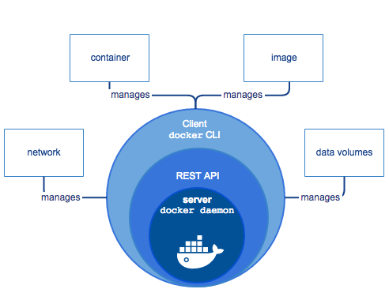
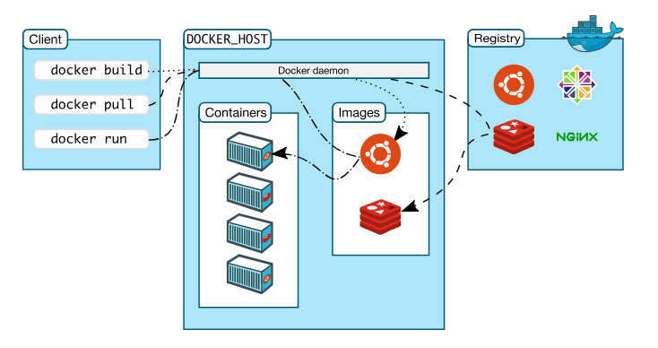

## Docker là gì?

- Docker là một nền tảng mã nguồn mở giúp các nhà phát triển xây dựng, triển khai, chạy, cập nhật và quản lý các ứng dụng container hóa.
- Docker cho phép **đóng gói ứng dụng** và tất cả các phụ thuộc của nó **vào một đơn vị tiêu chuẩn gọi là container**, giúp ứng dụng có thể **chạy một cách nhất quán trên nhiều môi trường khác nhau**.

## Docker Engine là gì?

- **Docker engine** là một phần mền dạng “client-server” bao gồm các thành phần chính sau:
  - **Server** hay còn được gọi là **docker daemon (dockerd)**: chịu trách nhiệm tạo, quản lý các **Docker objects** như **images**, **containers**, **networks**, **volume**.
  - **REST API**: là nơi nhận các yêu cầu từ phía **Docker client** và giao tiếp với **Docker daemon** để yêu cầu **Docker daemon** thực thi các yêu cầu từ phía người dùng.
  - **Docker CLI** có vai trò là client, cung cấp giao diện tương tác với người dùng (command line) và gửi các request tương ứng đến Docker Daemon thông qua REST API. (Ví dụ docker images, docker ps, docker rmi image v.v..)
    

## Kiến trúc của Docker

- Docker sử dụng kiến trúc client – server.
- Docker server (hay còn gọi là daemon) sẽ chịu trách nhiệm build, run, distrubute Docker container
- Docker client và Docker server có thể nằm trên cùng một server hoặc khác server.
- Chúng giao tiếp với nhau thông qua REST API dựa trên UNIX sockets hoặc network interface.
  

  - **Docker daemon**:
    - Docker daemon (dockerd) là thành phần core, lắng nghe API request và quản lý các Docker object.
    - Docker daemon host này cũng có thể giao tiếp được với Docker daemon ở host khác.
  - **Docker client**:
    - Docker client (docker) là phương thức chính để người dùng thao tác với Docker.
    - Khi người dùng gõ lệnh docker run imageABC tức là người dùng sử dụng CLI và gửi request đến dockerd thông qua api, và sau đó Docker daemon sẽ xử lý tiếp.
    - Docker client có thể giao tiếp và gửi request đến nhiều Docker daemon.
  - **Docker registry**:
    - Docker registry sẽ là nơi lưu trữ các Docker image.
    - Docker Hub là nơi lưu trữ Docker image công khai (public registry) mà bất kỳ ai cũng có thể sử dụng và Docker được định cấu hình mặc định để tìm image trên Docker Hub.
    - Nổi tiếng nhất chính là Docker Hub, ngoài ra bạn có thể tự xây dựng một Docker registry riêng tư khác để lưu trữ Docker image.
  - **Docker object**:

    - Khi sử dụng Docker, bạn sẽ khởi tạo và sử dụng image, container, network, volume, plugin và các đối tượng khác.

    - **Docker Image**:
      - Docker Image là template read-only (chỉ cho phép đọc) với các hướng dẫn để tạo Docker container.
      - Image sẽ được sử dụng để đóng gói các ứng dụng và các thành phần đi kèm của ứng dụng, được lưu trữ ở server hoặc trên registry.
      - Ví dụ bạn có thể sử dụng Dockerfile để tạo ra một Docker image sử dụng hệ điều hành Ubuntu và cài đặt Apache server với những cài đặt, cấu hình tùy chỉnh của riêng mình.
    - **Docker container**:
      - Container được chạy dựa trên 1 image cụ thể. Bạn có thể tạo, start, stop, move, delete container.
      - Bạn cũng có thể kết nối các container với nhau hoặc attach storage cho nó, thậm chí là tạo lại một image từ chính state hiện tại của container
      - Mặc định 1 container được “cách ly” với các container và server nếu người dùng không có các cài đặt gì thêm.
    - **Docker volume**:

      - Volume được thiết kể để làm nơi lưu trữ các dữ liệu độc lập với vòng đời của container.

    - **Docker network**:

      - Cung cấp một private network mà chỉ tồn tại giữa container và server, giúp các container có thể giao tiếp được với nhau một cách dễ dàng.

    - **Docker service**:

      - Service cho phép bạn mở rộng các contaner thông qua nhiều Docker daemon, chúng giao tiếp với nhau thông qua swarm cluster bao gồm nhiều manager và worker. Mỗi một node của swarm là 1 Docker daemon giao tiếp với nhau bằng cách sử dụng Docker API. Theo mặc định thì service được cân bằng tải trên các node.

    https://www.youtube.com/watch?v=WX0YLs1Jnjs&list=PLncHg6Kn2JT4kLKJ_7uy0x4AdNrCHbe0n&index=13

    https://blog.cloud365.vn/container/tim-hieu-docker-phan-3/
    https://tel4vn.edu.vn/blog/gioi-thieu-tong-quan-ve-kien-truc-cua-docker/

https://kungfutech.edu.vn/khoa-hoc/docker

http://192.168.75.115:9090/hello

## Dockerfile

- Dockerfile là một tệp văn bản chứa các hướng dẫn để xây dựng một Docker image.

## Docker Compose

- Docker Compose là một công cụ giúp quản lý các container Docker trong một ứng dụng
- Cho phép bạn định nghĩa và chạy nhiều container cùng nhau một cách dễ dàng, đồng thời tự động hóa việc thiết lập mạng và kết nối giữa các container.

Code: https://github.com/NgaLe02/SpringBoot_Docker/tree/springboot_docker-ver1
