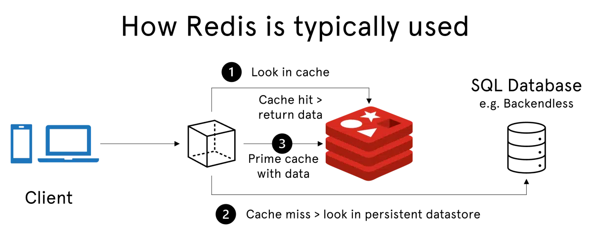
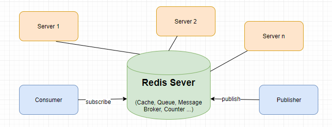
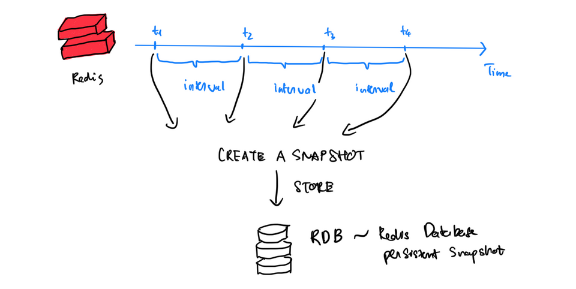

## Khái niệm

- Redis là một hệ thống lưu trữ dữ liệu **dạng key-value** mã nguồn mở.

- là một mã nguồn mở được dùng để lưu trữ **dữ liệu có cấu trúc**, có thể sử dụng như một **database**, bộ nhớ **cache** hay một **message broker**.

## Ứng dụng

- Caching: Sử dụng làm bộ nhớ đệm
- Session management: Redis có thể được sử dụng để lưu trữ thông tin session của người dùng, giúp ứng dụng web hoạt động hiệu quả hơn
- Real-time applications
- Game online
- Publish/ Suscribe: Tạo kênh chia sẻ dữ liệu. Redis hỗ trợ tạo các channel để trao đổi dữ liệu giữa publisher và subscriber giống như channel trong Socket Cluster hay topic trong Apache Kafka. Ví dụ: Pub/Sub được sử dụng theo dõi các kết nối trong mạng xã hội hoặc các hệ thống chat.
  

## Các kiểu dữ liệu trong Redis

- String
- List
- Set
- Sorted Set
- Hash
- Bitmap
- Stream
- Geospatial (Dữ liệu địa không gian): Lưu trữ dữ liệu địa lý như điểm, đường thẳng, đa giác.
- HyperLogLogs: Đây là một cấu trúc dữ liệu xác suất ước tính cho việc đếm số lượng phần tử duy nhất trong một tập hợp

## Redis persistence

- Redis Persistent là tính năng của Redis cho phép lưu trữ dữ liệu trên đĩa cứng (disk storage) để đảm bảo sự an toàn dữ liệu và khả năng khôi phục sau khi khởi động lại hệ thống
- Redis hỗ trợ hai phương pháp lưu trữ dữ liệu trên đĩa gồm:
  - RDB (Redis Database Backup):
    - Thực hiện tạo và sao lưu bản sao của DB vào ổ cứng dưới dạng tệp tin RDB sau mỗi khoảng thời gian nhất định.
    - Tệp tin này có thể được sử dụng để khôi phục dữ liệu khi cần thiết
      
  - AOF (Append Only File):
    - Là một phương pháp lưu trữ dữ liệu theo dõi tất cả các thao tác ghi vào Redis
    - Các thao tác này sẽ được chạy lại khi restart server hoặc tái thiết lập dataset ban đầu.

## Ref

- https://backendless.com/redis-what-it-is-what-it-does-and-why-you-should-care/
- https://fptshop.com.vn/tin-tuc/danh-gia/redis-la-gi-173207
- https://topdev.vn/blog/redis-la-gi/?utm_source=google&utm_medium=cpc&utm_campaign=pmax-company&utm_content=performance&gad_source=1&gclid=CjwKCAjw1920BhA3EiwAJT3lSRck2xzEIjXALAe1oKOeQgTnHWKPtTL5KLa_aD5UgqQfC7Pg9gpTWhoCAsoQAvD_BwE

https://www.youtube.com/watch?v=0pOVQCDEcxI

- cd bin/
- ./jmeter

Code: https://github.com/NgaLe02/SpringBoot_Docker/tree/springboot-docker-ver2
