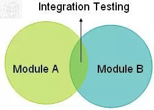

## Unit Testing

- Unit test là một dạng white box testing, do lập trình viên viết ra, dùng để test đơn vị nhỏ nhất của code (unit), thường là một function, method hoặc class.

- Một điểm quan trọng khi viết unit test đó là **tính độc lập**. Mỗi code unit cần được thực hiện độc lập với nhau, không phụ thuộc vào nhau. Nếu có sự phụ thuộc thì sử dụng kĩ thuật **Mock**, thay thế function phụ thuộc bằng function fake.

- 1 số khái niệm:

  - Assertion (Xác nhận): Assertion là một câu lệnh trong Unit Test dùng để kiểm tra xem kết quả thực tế của một đơn vị code có khớp với kết quả mong đợi hay không.
  - Mock: là kỹ thuật tạo ra các đối tượng giả trong Unit Test để thay thế cho các đối tượng phụ thuộc của đơn vị code cần kiểm tra.
  - Method stub: là một đối tượng giả có thể được sử dụng để thay thế cho một phương thức thực trong Unit Test.

- Code: https://github.com/NgaLe02/VCCORP/tree/main/WEEK6/CODE/testEx
- Ref:

  https://www.freecodecamp.org/news/java-unit-testing/#:~:text=Unit%20Testing%20involves%20testing%20each,as%20expected%20before%20releasing%20it.
  https://codelearn.io/sharing/unit-test-sieu-co-ban-voi-java

## Func Testing (Kiểm thử chức năng)

- là một loại kiểm thử hộp đen
- Các chức năng sẽ được kiểm tra bằng cách nhập các giá trị đầu vào và sau đó sẽ kiểm tra, đánh giá các kết quả đầu ra mà không cần quan tâm đến các cấu trúc hay cài đặt bên trong của ứng dụng.
- Những kỹ thuật thường dùng trong kiểm thử chức năng bao gồm:

  - User Navigation Testing: Kiểm thử điều hướng người dùng.
  - Transaction Screen Testing: Kiểm thử thao tác trên màn hình.
  - Transaction Flow Testing: Kiểm thử luồng thực hiện.
  - Report Screen Testing: Kiểm thử màn hình báo cáo.
  - Report Flow Testing: Kiểm thử luồng báo cáo.

## Integration Test

- Mỗi môđun phần mềm riêng biệt được kết hợp lại và kiểm thử theo nhóm.
  
- Ví dụ tích hợp các module: Đăng ký và xác thực người dùng / Đăng nhập,
  Danh mục sản phẩm,
  Giỏ hàng,
  Thanh toán,
  Tích hợp cổng thanh toán,
  Theo dõi vận chuyển và gói hàng
- Các phương pháp:
  - Bigbang: Tất cả các thành phần được tích hợp cùng một lúc, sau đó tiến hành kiểm thử.
  - Incremental testing: Ghép hai hoặc nhiều module có liên quan đến logic. Sau đó, các module liên quan khác được thêm vào và kiểm thử chức năng thích hợp. Quá trình tiếp tục cho đến khi tất cả các module được thêm và hoàn thành quá trình kiểm thử.

## Load/stress test

- Dùng để kiểm thử hiệu suất (performance testing )
- Stress testing (kiểm thử căng thẳng) là một loại kiểm thử hiệu suất (performance testing) trong đó hệ thống hoặc ứng dụng phần mềm được đưa vào tình huống hoạt động ở mức tải cao hơn so với mức tải bình thường.
- Load testing là một phương pháp kiểm thử hiệu năng của hệ thống bằng cách tạo ra một tải trọng giả lập để đánh giá khả năng hoạt động và xử lý của hệ thống khi đối mặt với một lượng lớn người dùng hoặc tải trọng cao.
- Load tests help you understand how a system behaves under an expected load.
- Stress tests help you understand the upper limits of a system's capacity using a load beyond the expected maximum.
- https://loadninja.com/articles/load-stress-testing/#:~:text=Load%20tests%20help%20you%20understand,load%20beyond%20the%20expected%20maximum.
