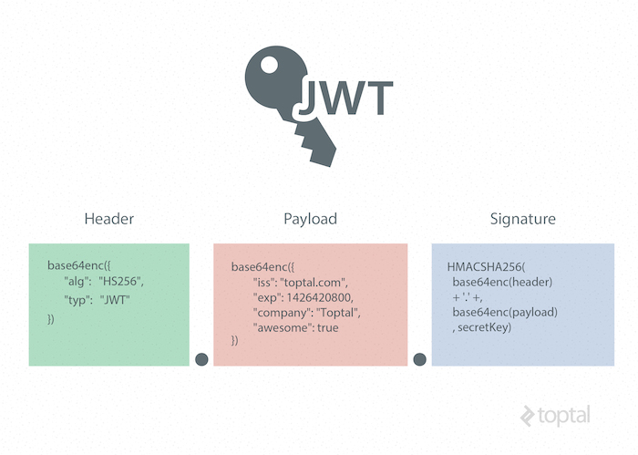
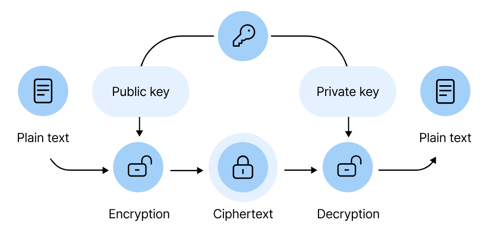
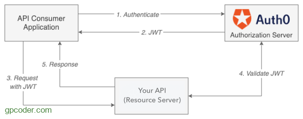

### 7.4 Tìm hiểu về authentication

- JWT
- Basic Auth
- Token Auth

## Tìm hiểu về Authentication (Xác thực)

### Authentication là gì?

- Authentication xác nhận danh tính của user để cấp quyền truy cập vào hệ thống
- Đây là quá trình xác nhận thông tin đăng nhập để có quyền truy cập của người dùng.

- refer:[Auth](https://gpcoder.com/5825-tim-hieu-ve-xac-thuc-va-phan-quyen-trong-ung-dung/#:~:text=Authentication%20x%C3%A1c%20nh%E1%BA%ADn%20danh%20t%C3%ADnh,truy%20c%E1%BA%ADp%20c%E1%BB%A7a%20ng%C6%B0%E1%BB%9Di%20d%C3%B9ng)

## JWT

### Khái niệm

- JSON Web Token (JWT) là 1 tiêu chuẩn mở (RFC 7519), định nghĩa cách thức truyền tin an toàn giữa các ứng dụng bằng một đối tượng **JSON**.

- Dữ liệu truyền đi sẽ được _mã hóa_ và _chứng thực_, có thể được _giải mã_ để lấy lại thông tin và đánh dấu tin cậy _nhờ vào “chữ ký”_ của nó. Phần chữ ký của JWT sẽ được *mã hóa*lại bằng **HMAC** hoặc **RSA**.

- JWT có 2 đặc điểm:

  - Gọn nhẹ (compact): JWT có thể được truyền đi thông qua URL, hoặc qua giao thức POST, hay gán vào bên trong phần HTTP Header.
  - Tự đóng gói (self-contained): Payload của JWT đã chứa các thông tin cần thiết về user (thay vì phải truy vấn cơ sở dữ liệu nhiều lần).

### Thành phần

- JWT bao gồm 3 phần, ngăn cách nhau bởi dấu “.“, gồm:

  - Header
  - Payload
  - Signature
    => Chuỗi JWT: header.payload.signature

    

#### Header

- Header sẽ chứa type của token, giá tri là JWT, và thuật toán mã hóa ra chuỗi JWT (HMAC SHA256 hay RSA).

```
{
    "typ": "JWT",
    "alg": "HS256"
}
```

#### Payload

- Phần payload sẽ chứa các thông tin mình muốn đặt trong chuỗi Token như username , userId , author ... (Chứa các thông tin về đối tượng (thường là user), và các meta data của token).

```
{
  "user_name": "admin",
  "user_id": "1513717410",
  "authorities": "ADMIN_USER",
  "jti": "474cb37f-2c9c-44e4-8f5c-1ea5e4cc4d18"
}
```

#### Signature

- Signature được tạo ra bằng cách dùng thuật toán mã hóa được chỉ định ở header để mã hóa nội dung encode của **header**, **payload**, cùng với **chuỗi khóa bí mật (secret)**.

- Phương thức mã hóa có thể là HMAC hay RSA:

  - **HMAC**: đối tượng khởi tạo JWT (token issuer) và đầu nhận JWT (token verifier) sử dụng chung 1 mã bí mật để mã hóa và kiểm tra.
  - **RSA**: sử dụng 1 cặp key, đối tượng khởi tạo JWT sử dụng Private Key để mã hóa, đầu nhận JWT sử dụng Public Key để kiểm tra.
    

### Hoạt động



- Application hoặc client gửi thông tin chứng thực lên server (có thể là username/ password).
- Khi đã chứng thực thành công, authorization server sẽ trả về một access token (JWT) cho client.
- Phía Client sẽ gửi token này kèm theo request để truy cập resource. Thông thường token được gửi trong header: **Authorization: Bearer <token>**

- refer: [JWT](https://gpcoder.com/5827-gioi-thieu-json-web-token-jwt/)

## Basic Auth

- `Basic Auth` là cơ chế xác thực đơn giản nhất của một ứng dụng web. Cách hoạt động của Basic Auth là gửi chính **username + password** của người dùng theo mỗi request.


## Token Auth

- `Token-based Authentication` là cơ chế xác thực người dùng dựa trên việc tạo ra **token** – một chuỗi ký tự (thường được mã hóa) mang **thông tin xác định người dùng** được **server tạo ra** và **lưu ở client**. Server sau đó có thể **không lưu lại** token này.


## So sánh

| ĐẶC ĐIỂM    | BASIC                            | TOKEN-BASED                                              |
| ----------- | -------------------------------- | -------------------------------------------------------- |
| Dấu hiệu    | username + password              | Chuỗi mang thông tin được mã hóa                         |
| Truyền tải  | Authorization Header             | Header (Auth, custom) / URL / Body                       |
| Lưu Server  | Không lưu (vì chính là UserDB)   | Không lưu (vì token chứa đủ thông tin rồi)               |
| Lưu Client  | Browser tự lưu (username + pass) | Local storage, Cookie, session storage (browser)         |
| Cách verify | So sánh với User trong database  | Kiểm tra tính toàn vẹn của token qua signature của token |
| Phù hợp cho | Hệ thống internal                | Web API của hệ thống phân tán, đa nền tảng,…             |
