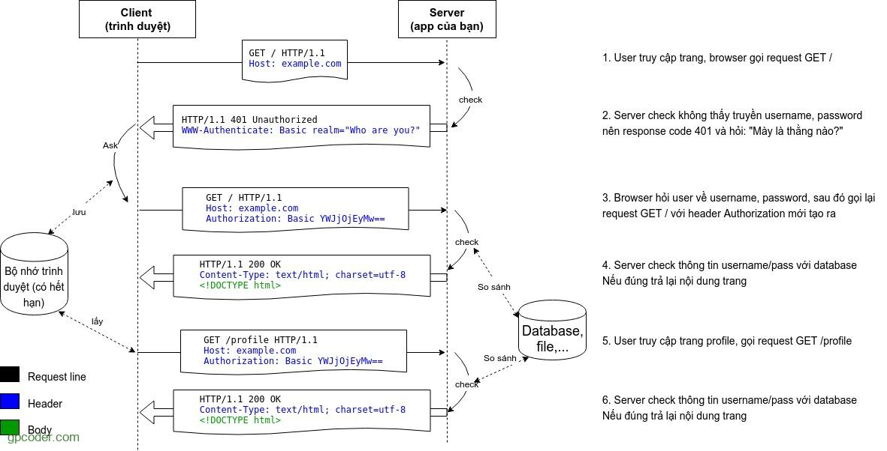
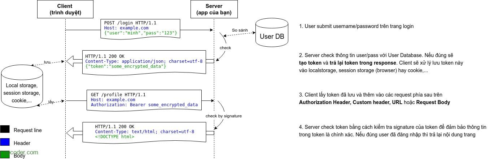

### 7.4 Tìm hiểu về authentication

- JWT
- Basic Auth
- Token Auth

## Tìm hiểu về Authentication (Xác thực)

### Authentication là gì?

- Authentication xác nhận danh tính của user để cấp quyền truy cập vào hệ thống
- Đây là quá trình xác nhận thông tin đăng nhập để có quyền truy cập của người dùng.

- refer: https://gpcoder.com/5825-tim-hieu-ve-xac-thuc-va-phan-quyen-trong-ung-dung/#:~:text=Authentication%20x%C3%A1c%20nh%E1%BA%ADn%20danh%20t%C3%ADnh,truy%20c%E1%BA%ADp%20c%E1%BB%A7a%20ng%C6%B0%E1%BB%9Di%20d%C3%B9ng.

## JWT

## Basic Auth

- `Basic Auth` là cơ chế xác thực đơn giản nhất của một ứng dụng web. Cách hoạt động của Basic Auth là gửi chính **username + password** của người dùng theo mỗi request.

## Token Auth

- `Token-based Authentication` là cơ chế xác thực người dùng dựa trên việc tạo ra **token** – một chuỗi ký tự (thường được mã hóa) mang **thông tin xác định người dùng** được **server tạo ra** và **lưu ở client**. Server sau đó có thể **không lưu lại** token này.

| ĐẶC ĐIỂM    | BASIC                            | TOKEN-BASED                                              |
| ----------- | -------------------------------- | -------------------------------------------------------- |
| Dấu hiệu    | username + password              | Chuỗi mang thông tin được mã hóa                         |
| Truyền tải  | Authorization Header             | Header (Auth, custom) / URL / Body                       |
| Lưu Server  | Không lưu (vì chính là UserDB)   | Không lưu (vì token chứa đủ thông tin rồi)               |
| Lưu Client  | Browser tự lưu (username + pass) | Local storage, Cookie, session storage (browser)         |
| Cách verify | So sánh với User trong database  | Kiểm tra tính toàn vẹn của token qua signature của token |
| Phù hợp cho | Hệ thống internal                | Web API của hệ thống phân tán, đa nền tảng,…             |
