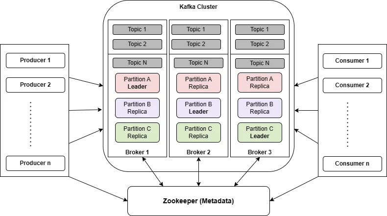
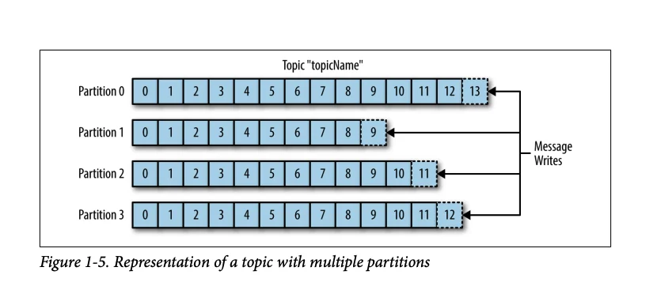
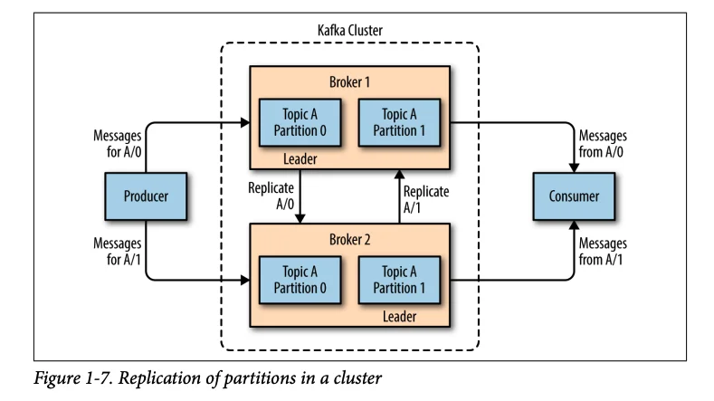
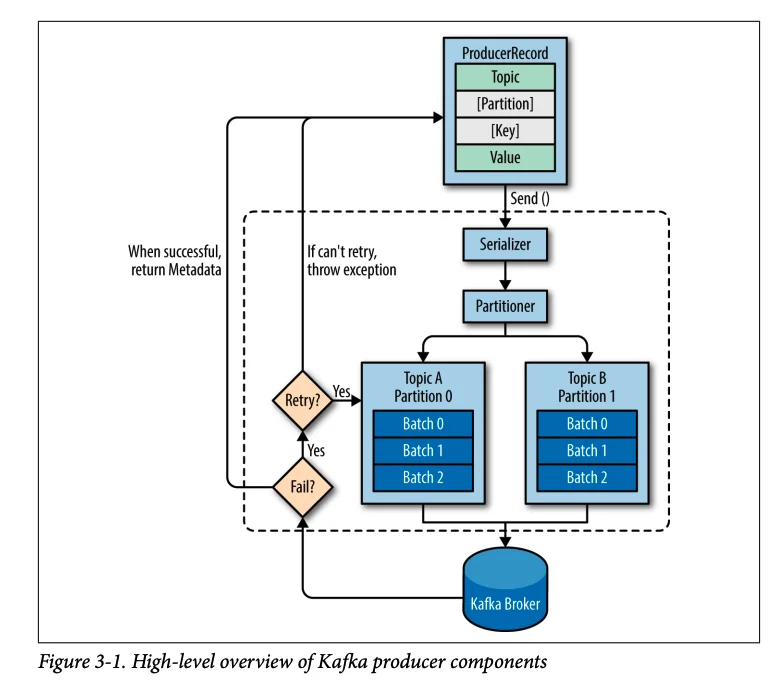
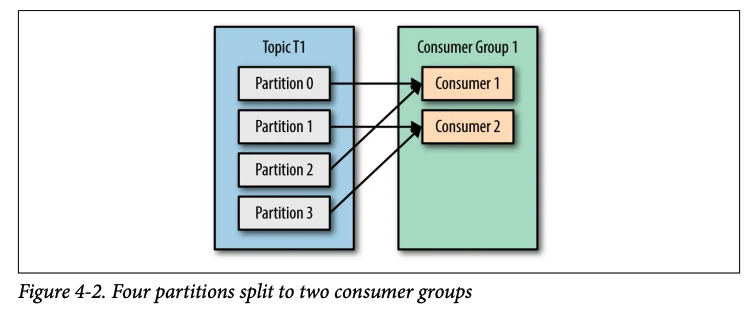
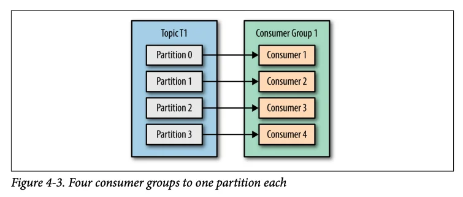
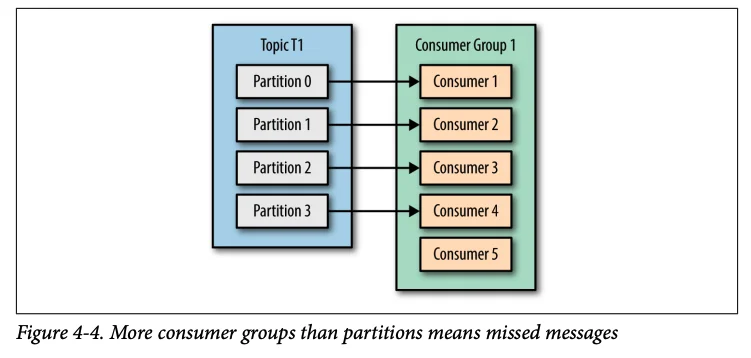
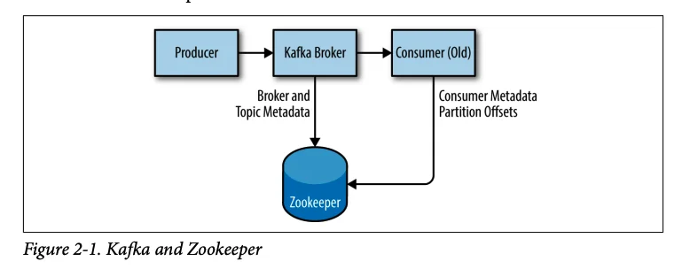

## Khái niệm

- Apache Kafka là một nền tảng mã nguồn mở, phân tán được sử dụng để xử lý luồng dữ liệu thời gian thực.

- Kafka được tạo ra để giải quyết những thách thức trong việc xử lý lượng dữ liệu khổng lồ trong thời gian thực (real-time), cho phép các ứng dụng xuất bản (publish), đăng ký (subscribe), lưu trữ (store) và xử lý (process) các luồng bản ghi (streaming event) một cách hiệu quả.

## Thành phần



### 1. Kafka Event

- Kafka Event hay còn gọi là message hoặc record là đơn vị cơ bản được gửi và nhận trong hệ thống Kafka. Đây là một bản ghi dữ liệu chứa thông tin về một sự kiện nào đó đã xảy ra

- Mỗi event chứa một key (khoá), value (giá trị) và metadata (nếu có).

```
{
	key: "Violet",
	value: "Made a payment of $100 to Alex",
	timestamp: "Jun. 25, 2023, at 2:06 p.m."
}
```

### 2. Kafka Topic

- Các event được tổ chức và lưu trữ lâu dài trong các topics (chủ đề).
- Các producer gửi message đến một topic cụ thể và các consumer đăng ký vào các topic để nhận message.
  

### 3. Kafka Brokers và Kafka Clusters

- Kafka cluster là một set các server, mỗi một set này được gọi là 1 broker

- Brokers chịu trách nhiệm quản lý bộ lưu trữ, xử lý các yêu cầu đọc và ghi cũng như sao chép dữ liệu trên toàn cluster (cụm).

### 4. Kafka Partitions và Kafka Replication

- Đây là nơi dữ liệu cho một topic được lưu trữ. Một topic có thể có một hay nhiều partition.

- Trên mỗi partition thì dữ liệu lưu trữ cố định và được gán cho một ID gọi là offset, bắt đầu từ 0 và tăng dần cho mỗi event tiếp theo. Offset được sử dụng để xác định vị trí của event trong một partition.

- Kafka đảm bảo độ bền của dữ liệu bằng cách sao chép dữ liệu (replication) trên nhiều brokers. Mỗi partition có thể có một hoặc nhiều replica (bản sao) trên các brokers khác nhau, ngăn ngừa mất dữ liệu trong trường hợp broker lỗi.
  

- Mỗi partition có một broker được chỉ định làm leader, nắm quyền sở hữu partition đó, trong khi các brokers còn lại lưu trữ các replicas (bản sao) của phân vùng đó được gọi là followers.

- Nếu leader broker xảy ra lỗi, một trong những followers có dữ liệu cập nhật sẽ được chọn làm leader mới.

### 5. Kafka Producers

- Kafka Producer là một client appication (ứng dụng khách), publish (xuất bản) event vào một topic cụ thể trong Kafka và luôn ghi vào leader broker

- Theo mặc định, producers không quan tâm tới event được ghi ở partition nào mà sẽ publish đều event trên tất cả partition của một topic. Trong vài trường hợp, một producer sẽ gửi trực tiếp event tới các partition cụ thể.

- Tổng quan về các thành phần trong Kafka producers:
  

- Quá trình gửi event từ Kafka producers tới Kafka brokers bao gồm 4 bước:
  - Bước 1: Tạo ProducerRecord
  - Bước 2: Serializer
  - Bước 3: Xác định số partitions
  - Bước 4: Brokers xử lý events và trả về kết quả cho producers
- Refer: [hehe](https://200lab.io/blog/kafka-la-gi/)

### 6. Kafka Consumers

- Kafka consumer là một client application (ứng dụng khách), subscribe (đăng ký) một hoặc nhiều Kafka topics và đọc các bản ghi theo thứ tự chúng được tạo ra

- Consumers hoạt động trong một consumer group, làm việc cùng nhau để xử lý dữ liệu từ các partitions

- Khi một consumer group đọc các event từ các partitions, chúng ta có 3 trường hợp xảy ra như sau:
  - Trường hợp 1: Consumer group có số consumers **nhỏ hơn** số partitions của một topic.
    - Consumer 1 và 2 lần lượt đọc các event từ 4 partitions của Topic T1.
      
  - Trường hợp 2: Consumer group có số consumers **bằng** số partitions của một topic.
    - Mỗi consumer sẽ đọc event từ một partition tương ứng.
      
  - Trường hợp 3: Consumer group có số consumers **lớn hơn** số partitions của một topic.
    

### 7. ZooKeepers

- ZooKeepers được sử dụng để quản lý, lưu trữ metadata của clusters và điều phối các consumers.
  

## Refer

[Video](https://www.youtube.com/watch?v=HGywc-e5f4E&list=PLsfLgp1K1xQ42CWP8dsIa7OT2EJFnRGGd)
[K2](https://topdev.vn/blog/kafka-la-gi/)
[k3](https://200lab.io/blog/kafka-la-gi/)
[QuickStart](https://kafka.apache.org/quickstart)

## Cmd

- Windows:
  - **Start the ZooKeeper service**: bin\windows\zookeeper-server-start.bat config\zookeeper.properties
  - **Start the Kafka broker service**: bin\windows\kafka-server-start.bat config\server.properties
  - **Start the Kafka broker service 2**: bin\windows\kafka-server-start.bat config\server.properties --override listeners=PLAINTEXT://:9093 --override broker.id=1 --override log.dirs=/tmp/kafka-logs-1
  - **Start the Kafka broker service 3**: bin\windows\kafka-server-start.bat config\server.properties --override listeners=PLAINTEXT://:9094 --override broker.id=2 --override log.dirs=/tmp/kafka-logs-2

- Install Offset Explorers in Ubuntu:
  - Access this page https://www.kafkatool.com/download.html 
  - Copy link address of download linux as URL
  - Open terminal
  - wget URL
  - chmod +x ten_file.sh
  - ./ten_file.sh