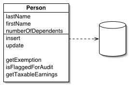
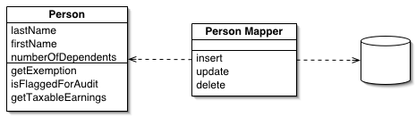

### 7.2 Tìm hiểu về ORMs & Transactions trong cơ sở dữ liệu

## ORMs

### Khái niệm

- ORM (Object-Relational Mapping) là một kỹ thuật lập trình giúp ánh xạ cấu trúc của cơ sở dữ liệu quan hệ phức tạp vào các đối tượng trong phần mềm được viết bằng các ngôn ngữ hướng đối tượng

### Các loại ORMs

- Có nhiều loại ORM được sử dụng trong lập trình, nhưng hai loại phổ biến nhất là **Active Record** và **Data Mapper**.

  - **Active Record** cho phép các đối tượng được định nghĩa bởi các lớp được kết nối với các bảng trong cơ sở dữ liệu.
    
  - **Data Mapper** tách biệt đối tượng khỏi cơ sở dữ liệu và tập trung vào việc ánh xạ các đối tượng vào các bảng dữ liệu.
    

### Hoạt động

ORM giải quyết vấn đề đồng bộ giữa kiểu dữ liệu trả về khác nhau. Một bên là cơ sở dữ liệu, ở đó dữ liệu được thể hiện dưới dạng tập hợp các bản ghi. Một bên là các đối tượng, ở đó dữ liệu đc hiện thị dưới dạng object

### ORMs trong Java

- Hibernate
- TopLink
- EclipseLink
- OpenJPA
- MyBatis (formally known as iBatis)

- Refer: [T1](https://viblo.asia/p/object-relational-mapping-djeZ1PQ3KWz)

## Transactions

### Khái niệm

- Transaction là một tiến trình xử lý có xác định điểm đầu và điểm cuối, được chia nhỏ thành các operation (phép thực thi) , tiến trình được thực thi một cách tuần tự và độc lập các operation đó theo nguyên tắc hoặc tất cả đều thành công hoặc một operation thất bại thì toàn bộ tiến trình thất bại.
- Nếu việc thực thi một operation nào đó bị fail (hỏng) đồng nghĩa với việc dữ liệu phải rollback (trở lại) trạng thái ban đầu.

### Các thuộc tính của Transactions => ACID

#### Atomicity (Tính nguyên tử)

- Mọi thay đổi về mặt dữ liệu phải được thục hiện trọn vẹn khi transaction thực hiện thành công hoặc không có bất kì sự thay đổi nào về mặt dữ liệu nếu có xẩy ra sự cố.

#### Consistency (Tính nhất quán)

- Sau khi một transaction kết thúc thì tất cả dữ liệu phải được nhất quán dù thành công hay thất bại.

#### Isolation (Tính độc lập)

- Các transaction khi đông thời thực thi trên hệ thống thì không có bất kì ảnh hưởng gì tời nhau.

#### Durability (Tính bền vững)

- Sau khi một transaction thành công thì tác dụng mà nó tạo ra phải bền vững trong cơ sở dữ liệu cho dù hệ thống có xẩy ra lỗi.

- Refer: [T1](https://viblo.asia/p/tim-hieu-ve-transactions-maGK73xeKj2)

### Vấn đề đọc ghi dữ liệu của 1 row khi nó dính đễn transaction

- `Read uncommited`: Khi transaction thực hiện ở mức này, các truy vấn vẫn có thể truy nhập vào các bản ghi đang được cập nhật bởi một transaction khác và nhận được dữ liệu tại thời điểm đó mặc dù dữ liệu đó chưa được commit (uncommited data) => dirty read

  - Ví dụ:
    Transaction A đọc một giá trị từ cơ sở dữ liệu.
    Transaction B sửa đổi giá trị đó và chưa commit.
    Transaction A có thể đọc giá trị đã được sửa đổi bởi transaction B, mặc dù transaction B chưa được hoàn tất.

- `Read committed`: Transaction sẽ không đọc được dữ liệu đang được cập nhật mà phải đợi đến khi việc cập nhật thực hiện xong => phantom read

  - Ví dụ:
    Transaction A đọc một giá trị từ cơ sở dữ liệu.
    Transaction B sửa đổi giá trị đó và commit.
    Transaction A chỉ có thể đọc giá trị đã được sửa đổi bởi transaction B sau khi transaction B được cam kết.

- `Repeatable read`: Giao dịch hiện tại sẽ không nhìn thấy các thay đổi được thực hiện bởi các giao dịch khác chưa được commit

  - Ví dụ:
    Transaction A đọc một tập dữ liệu.
    Transaction B sửa đổi giá trị đó và commit.
    Transaction A không thể nhìn thấy sự thay đổi do transaction B thực hiện và vẫn đọc được tập dữ liệu ban đầu.

- `Serializable`: SQL đặt read + write lock trên dữ liệu cho tới khi transaction kết thúc.

  - Ví dụ:
    Transaction A và B truy cập cùng một hàng dữ liệu.
    Chỉ có một transaction có thể truy cập hàng dữ liệu tại một thời điểm, giống như trong hàng đợi.

- Refer: [T1](https://gitiho.com/blog/huong-dan-cac-kieu-cua-lenh-join-trong-mysql-inner-outer-left-right-cross.html)
  [T2](https://viblo.asia/p/dao-sau-ve-sql-transactions-E375z4jWZGW)
  [t3](https://www.youtube.com/watch?v=WKGIz5ViT7Y&t=391s)
