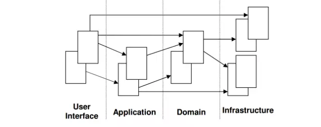

### 7.1 Tìm hiểu các pattarns

- Domain Driven Design
- CQRS & Event Sourcing

## Domain Driven Design (DDD)

### Khái niệm

- Domain - driven design là một cách tiếp cận trong việc xây dựng phần mềm phức tạp[1], sự phức tạp ở đây là những logic của lĩnh vực kinh doanh (domain business).

### Các lớp

- User Interface Layer
- Application Layer
- Domain Layer
- Infrastructure Layer

- https://medium.com/@ygnhmt/a-soft-introduction-to-domain-driven-design-from-theory-to-java-code-implementation-part-2-5aa7e1cfef65
- https://viblo.asia/p/gioi-thieu-design-pattern-domain-driven-design-ddd-Qbq5Q423lD8
- https://github.com/ttulka/ddd-example-ecommerce/blob/main/src/main/java/com/ttulka/ecommerce/sales/order/jdbc/OrderJdbcConfig.java
- https://topdev.vn/blog/domain-driven-design/

## CQRS và Event Sourcing

- CQRS (Command Query Responsibility Segregation): Một kiến trúc phần mềm tách biệt các hoạt động đọc và viết dữ liệu.
- https://viblo.asia/p/microservices-cung-voi-cqrs-va-event-sourcing-1Je5EDnYlnL

- Search: exampr project ddd cqrs & event sourcing, kafka
  - https://github.com/asimkilic/cqrs-event-sourcing-with-kafka/blob/master/.gitignore
  - https://blog.stackademic.com/how-to-implement-cqrs-event-sourcing-with-kafka-in-asp-net-core-microservices-architecture-ed7069d661a3
