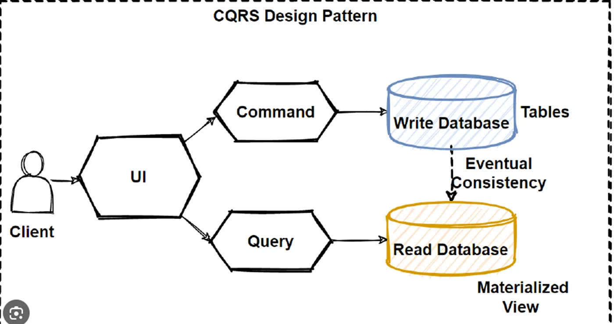
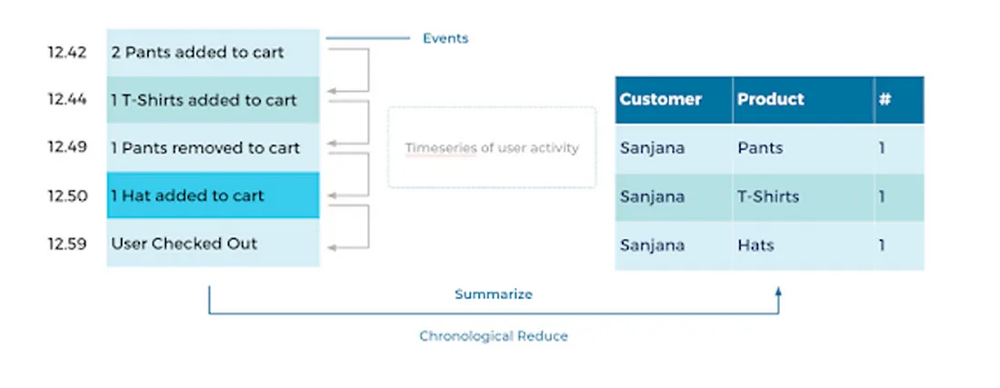
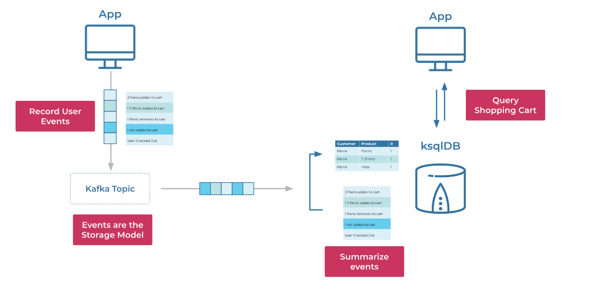

### 7.1 Tìm hiểu các pattarns

- Domain Driven Design
- CQRS & Event Sourcing

## Domain Driven Design (DDD)

### Khái niệm

- **Domain - driven design** là một cách tiếp cận trong việc xây dựng phần mềm phức tạp[1], sự phức tạp ở đây là những logic của lĩnh vực kinh doanh (domain business).

### Các lớp

- **User Interface Layer:** chịu trách nhiệm cho hiển thị thông tin, nhận lệnh từ người dùng
- **Application Layer:** Phối hợp các xử lý. Lưu ý là không chứa logic nghiệp vụ ở đây
- **Domain Layer:** Chứa các mô hình biểu diễn nghiệp vụ của hệ thống. Thể hiện logic của nghiệp vụ nhưng uỷ quyền việc cài đặt chi tiết cho Infra.
- **Infrastructure Layer:** Cung cấp các gói hỗ trợ, liên lạc, cài đặt chi tiết, sử dụng các thư viện bên ngoài..

- [ShouldRead](https://medium.com/@ygnhmt/a-soft-introduction-to-domain-driven-design-from-theory-to-java-code-implementation-part-2-5aa7e1cfef65)
- [Refe2]https://viblo.asia/p/gioi-thieu-design-pattern-domain-driven-design-ddd-Qbq5Q423lD8

## CQRS & Event Sourcing

- **CQRS (Command Query Responsibility Segregation):** Một kiến trúc phần mềm _tách biệt các hoạt động đọc và viết dữ liệu_.
  

- **Event Sourcing** is a pattern where the state of an application is _determined by a sequence of events_ instead of just the current state. It involves _capturing all changes to an application’s state as a sequence of events_.
  

- **CQRs & Event Sourcing:**
  

- Refer:

  - [CQRS](https://www.youtube.com/watch?v=VUcE_s0RoiY)

  - Search: exampr project ddd cqrs & event sourcing, kafka
    - [projecr1](https://github.com/asimkilic/cqrs-event-sourcing-with-kafka)
    - [guild-kafka](https://blog.stackademic.com/how-to-implement-cqrs-event-sourcing-with-kafka-in-asp-net-core-microservices-architecture-ed7069d661a3)
    - [introduce1](https://developer.confluent.io/courses/event-sourcing/cqrs/)
    - [introduce2](https://medium.com/@ocrnshn/event-sourcing-and-cqrs-9286e5578f93)
