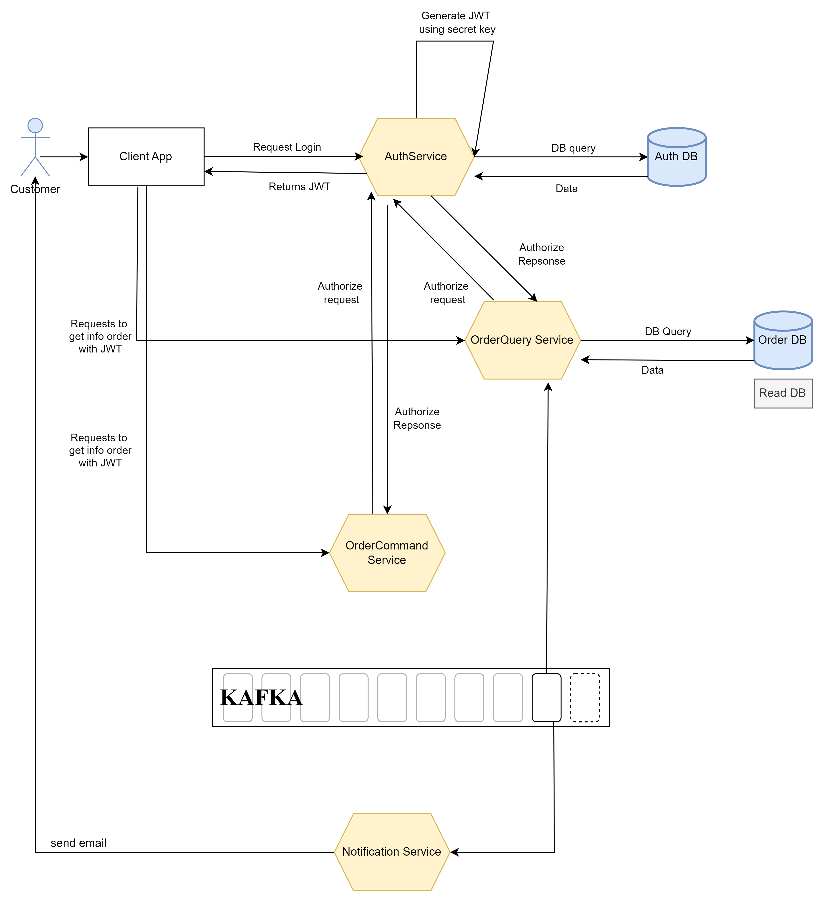

### Workflow overview

- Khách hàng đăng nhập
- Khách hàng đặt hàng qua OrderCommand Service
- OrderCommand publish a event to Kafka

- Notification Service nhận event và gửi mail cho khách hàng
- OrderQuery Service nhận event và lưu data vào db

- Khách hàng yêu cầu lấy info order
- OrderQuery Service nhận yêu cầu và lấy info cho khách hàng

### Anothers

- Authentication sử dụng JWT và Token Auth, sử dụng phương thức mã hóa RSA

- ORM: sử dung MyBatis

https://app.diagrams.net/#G10OEtzBpRlR10IFIEbNf0aUV9mRqdTlKW#%7B%22pageId%22%3A%228gHXTwWQPjXe424jTyJu%22%7D
