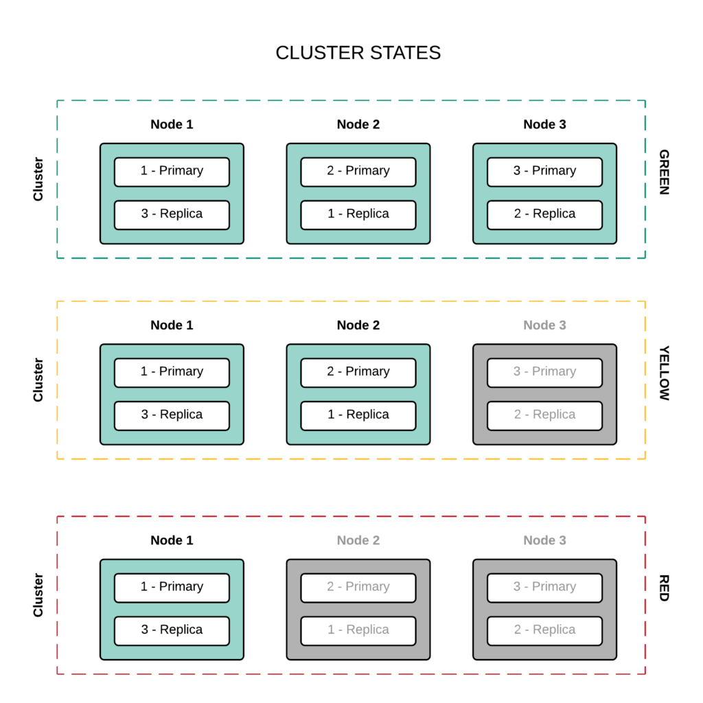

## Khái niệm

- ElasticSearch là một công cụ tìm kiếm dựa trên nền tảng Apache Lucene, được phát triển bằng Java. Nó cung cấp một bộ máy tìm kiếm dạng phân tán, có đầy đủ công cụ với một giao diện web HTTP có hỗ trợ dữ liệu JSON.

- Elasticsearch thực chất hoặt động như 1 web server, có khả năng tìm kiếm nhanh chóng (near realtime) thông qua giao thức RESTful

- Elasticsearch có khả năng phân tích và thống kê dữ liệu

## Hoạt động


- ES sẽ chạy một cổng (dưới local default là 9200).

## Elasticsearch component


### 1. Document

- Document là một JSON object với một số dữ liệu
- Ví dụ: Trong một index chứa thông tin người dùng, mỗi người dùng sẽ được biểu diễn bằng một document.

### 2. Index

- Sử dụng một cấu trúc được gọi là [inverted index](https://en.wikipedia.org/wiki/Inverted_index?ref=200lab.io).

- Ví dụ: Chúng ta có 2 văn bản cụ thể như sau :

```
1,The quick brown fox jumped over the lazy dog
2,Quick brown foxes leap over lazy dogs in summer
```

Inverted index tương ứng:
| Term | Doc_1 | Doc_2 |
|---------|-------|-------|
| Quick | | X |
| The | X | |
| brown | X | X |
| dog | X | |
| dogs | | X |
| fox | X | |
| foxes | | X |
| in | | X |
| jumped | X | |
| lazy | X | X |
| leap | | X |
| over | X | X |
| quick | X | |
| summer | | X |
| the | X | |

### 3. Shard

- Một Index có thể được chia thành nhiều shard.
- Mỗi node bao gồm nhiều Shard
- Shard lưu trữ dữ liệu.
- Có 2 loại Shard là : primary shard và replica shard.
- In order for this to be fault tolerant, the replicas can never be allocated on the same node as primary shard that they replicate.
  

#### 3.1 : Primary Shard

- Primary Shard là sẽ lưu trữ dữ liệu và đánh index . Sau khi đánh xong dữ liệu sẽ được vận chuyển tới các Replica Shard.
- Mặc định của Elasticsearch là mỗi index sẽ có 5 Primary shard và với mỗiPrimary shard thì sẽ đi kèm với 1 Replica Shard.

#### 3.2 : Replica Shard

- eplica Shard đúng như cái tên của nó, nó là nơi lưu trữ dữ liệu nhân bản của Primary Shard
- Replica Shard có vai trò đảm bảo tính toàn vẹn của dữ liệu khi Primary Shardxảy ra vấn đề.
- Ngoài ra Replica Shard có thể giúp tăng cường tốc độ tìm kiếm vì chúng ta có thể setup lượng Replica Shard nhiều hơn mặc định của ES

### 4. Node

- Là trung tâm hoạt động của Elasticsearch. Là nơi lưu trữ dữ liệu ,tham gia thực hiện đánh index cúa cluster cũng như thực hiện các thao tác tìm kiếm
- Mỗi node được định danh bằng 1 unique name

### 5. Cluster

- Tập hợp các nodes hoạt động cùng với nhau, chia sẽ cùng thuộc tính cluster.name. Chính vì thế Cluster sẽ được xác định bằng 1 ‘unique name’.
- Mỗi cluster có một node chính (master), được lựa chọn một cách tự động và có thể thay thế nếu sự cố xảy ra. Một cluster có thể gồm 1 hoặc nhiều nodes. Các nodes có thể hoạt động trên cùng 1 server .

## Refer

- [ES1](https://200lab.io/blog/elastic-search-la-gi/#21-c%C3%A1ch-elasticsearch-t%E1%BB%95-ch%E1%BB%A9c-l%C6%B0u-tr%E1%BB%AF-d%E1%BB%AF-li%E1%BB%87u)
- [ES2](https://stringee.com/vi/blog/post/elasticsearch-la-gi)
- [ES3](https://topdev.vn/blog/elasticsearch-la-gi/)
- [ES4](https://devopsideas.com/different-elasticsearch-components-and-what-they-mean-in-5-mins/)
