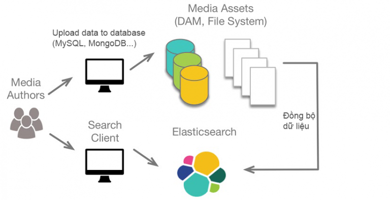

## Khái niệm

- ElasticSearch là một công cụ tìm kiếm dựa trên nền tảng Apache Lucene, được phát triển bằng Java. Nó cung cấp một bộ máy tìm kiếm dạng phân tán, có đầy đủ công cụ với một giao diện web HTTP có hỗ trợ dữ liệu JSON.

- Elasticsearch thực chất hoặt động như 1 web server, có khả năng tìm kiếm nhanh chóng (near realtime) thông qua giao thức RESTful

- Elasticsearch có khả năng phân tích và thống kê dữ liệu

## Hoạt động

- ES sẽ chạy một cổng (dưới local default là 9200).

## Các khái niệm cần biết

