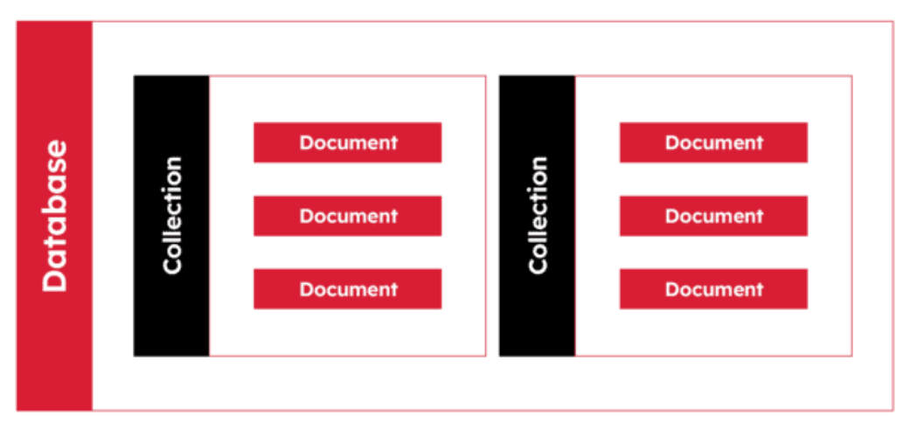

## Khái niệm

- MongoDB là một database hướng tài liệu (document), một dạng NoSQL database

- NoSQL (Not only SQL) được sử dụng thay thế cho cơ sở dữ liệu quan hệ (Relational Database – RDB) truyền thống.

## Các thuật ngữ MongoDB thường dùng

### 1.\_id

- \_id là một trường bắt buộc trong mọi document của MongoDB.
- \_id được sử dụng để đại diện cho tính duy nhất của một document trong một collection.
- Trường \_id hoạt động giống như khóa chính (primary key) của document.

### 2. Document

- Document mang vai trò tương tự như row trong các hệ thống cơ sở dữ liệu quan hệ truyền thống
- Document là một cách để sắp xếp và lưu trữ dữ liệu dưới dạng một tập hợp các cặp field-value
- Document không cần phải có cùng một bộ field hoặc cấu trúc với các document khác trong cùng một collection.

### 3. Collection

- Collection là một tập hợp các document
- Collection tương tự như table trong hệ thống cơ sở dữ liệu quan hệ
- Các document trong cùng một collection có thể có các trường khác nhau.

### 4. Database

- Database là một container vật lý chứa tập hợp các collection.
- Một database có thể chứa 0 collection hoặc nhiều collection

## Mối tương quan giữa thuật ngữ MongoDB và RDBMS

| RDBMS       | MongoDB                                                     |
| ----------- | ----------------------------------------------------------- |
| Database    | Database                                                    |
| Table       | Collection                                                  |
| Tuple/Row   | Document                                                    |
| Column      | Field                                                       |
| Table Join  | Embedded Documents                                          |
| Primary Key | Primary Key (Khóa mặc định `_id` do chính MongoDB cung cấp) |

## Refer

- [MongoDB1](https://itviec.com/blog/mongodb-la-gi/)
- [MongoDB2](https://viblo.asia/p/tim-hieu-ve-mongodb-4P856ajGlY3)
- [MongoDB3](https://stringee.com/vi/blog/post/mongodb-la-gi)
